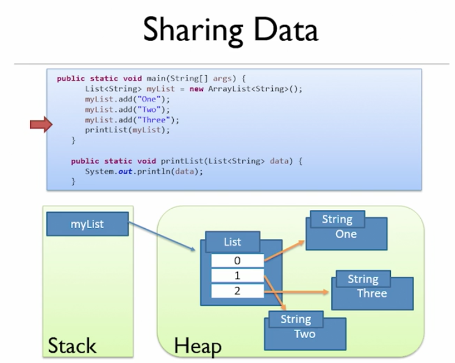

#### :house: [REVATURE workspace, HOME (`github`)](https://github.com/joedonline/REVATURE__workspace)  :house:
#### :house_with_garden: [REVATURE workspace, HOME (`delta`)](https://github.com/deltachannel/REVATURE__workspace) :house_with_garden:
---
# :calendar: [WEEK 01](https://github.com/joedonline/REVATURE__workspace/tree/master/WEEK__01)
## Tuesday, Dec. 17th 2019

---
## Java:
- Object-Oriented
- Pass by value
- Strictly typed, strongly typed
- Verbose

---
## Why Java?
- Widespread enterprise use
- W.O.R.A. -- Write once, run anywhere (JVM)
- "Simple"
- C-based syntax
- Automatic memory management (garbage collection)

---
## JDK: Java Development Kit
- includes `javac` compiler
  * java --> `.class`
  * Java --> Bytecode
- includes `JRE`: Java Runtime Environment
  * core classes & files
    - `java.lang`
    - `java.util`
    - etc.
- JVM: Java Virtual Machines ("Adapter")
  * Compiler: `.class` --> machine code (JIT - Just In Time) ((Kaizen??))
  * Class Loader / Linker ([Oracle, Java Reference](https://docs.oracle.com/javase/specs/jvms/se7/html/jvms-5.html))
  * Garbage collector

---
## OOP: Object-Oriented Programming

- A **programming paradigm** where objects are built from classes & have ***state*** & ***behavior***

#### 4 Pillars of OOP
- ##### ABSTRACTION
  * Take away details
  * Hiding intermediate (lower-level) steps
  * Design via interface, not implementation

- ##### POLYMORPHISM (Objects that takes "many forms")
  * "Being"
  * **Object Polymorphism**
    - The "`Is-a`" rule
    - "A Dog is an Animal"
  * **Method Polymorphism**
    - The same method name can have different functionality based on its class(overriding, runtime) or arguments(overloading, compile-time)
- ##### INHERITANCE
  * Share **state** & **behavior** (lines of code) from Parent to Child
- ##### ENCAPSULATION = Access
  * `public`, `private`
  * Objects **control** access to their **state** & **behavior**

---
## Practical OOP in Java
- Abstraction: Interfaces, Abstract Classes, Abstract Methods
- Polymorphhism:
  * **Object Polymorphism:** Class `extends` SuperClass --> Class "is-a" SuperClass
  * **Methtod Polymorphism:** Class `implements` Interface --> Class "is-a" Interface
- Inheritance: Class `extends` other Class
- Encapsulation: Access modifiers
  * `private` :: default :: `protected` :: `public`

---
### Naming Conventions
- Classes --> in `UpperCamelCase`
- "members" (fields, methods) --> `lowerCamelCase`
- Interfaces --> `UpperCamelCase`
- Constants --> `SCREAMING_SNAKE_CASE`

---
### `HelloWorld.java`

```
public class HelloWorld {

	// static ==> associated with the Class, not instance
	public static void main(String[] args) {
		System.out.println("Hello World");
	}

}
```

---
### Errors
- Compile-time :: syntax errors, etc.
- Runtime :: exceptions, etc.

---
### `HelloWorld.java`

```
public class HelloWorld {

	// static ==> associated with the Class, not instance
	public static void main(String[] args) {
		System.out.println("Hello World");
		System.out.println("myField is " + myField);
		repeatedPrint("This will NOT repeat 4x", 11);
	}

	private static String myField = "J.Lo";

	//  Write a method that takes a String and an Integer
	// and demonstrates Method Signatures, modifiers,
	// return types, method names

	/*
		<modifier> <return type> methodName(Type param, Type param) { ... }
	*/
	public static void repeatedPrint(String toPrint, Integer timesToPrint) {

		for (int i = 0; i < timesToPrint; i++) {
			System.out.println(toPrint);
		}

	}

}
```

---
## Data Types

### Primitives (non-objects) vs. Literals
| Primitives | Literals |
|-|-|
| `boolean` : `true` or `false`, *maybe* 1 bit | `true`, `false` |
| `byte` : (signed) integral value, 1 byte or 8 bits, { -128, ..., +127 } | 3b |
| `short` : (signed) integral value, 2 bytes | 3s |
| `int` : (signed) integral value, 4 bytes | 3 |
| `long` : (signed) integral value, 8 bytes | 3L |
| `char` : (unsigned) integral value, 2 bytes | `B` |
| `float` : (signed) decimal value, 4 bytes | 3.701f |
| `double` : (signed) decimal value, 8 bytes | 3.701 |

---
#### signed --> + or -
#### integral --> int --> 1, 2, 3, ...
#### decimal --> 0.1, 1.765, ...

---
### Key takeaways for binary
- Base 2 number system
- 0's, 1's
- `bit` ==> single `0` or `1`
- byte ==> 8 bits
- Numbers can *overflow* & wrap around

---
### Objects (also called *reference* types)
- Instances of a class
- All classes inherit from `java.lang.Object`
  * **All objects are instances of `java.lang.Object` (via "is-a" rule)**
- Objects occupy space in memory
- Objects have *state* & *behavior*

---
## Memory in JVM

  

### Heap
- is where objects are stored


### Stack
- is where ***method calls*** go
- stores the __flow of execution__ of your program
- Each method call goes on the Stack as a new **Stack Frame**
- Stack frames store references to objects and *primitive values*

| Stack |
|-|
|  |
| `println` |
| `repeatedPrint` |
| `main()` |


---
## Constructors
- __Every__ class has a Constructor
  * If we don't specify --> default Constructor
- Every constructor begins with either:
  * `super()`
  * or `this()`
  * if not specified --> `super()` is used
- The Constructor **instantiates** objects
- We call Constructors with the `new` keyword
- The Constructor has the exact same name as the Class
  * and is like a method with no return type.
- You can have multiple Constructors (overloading)
- **SIDE TERM to keep in mind: Constructor chaining  
