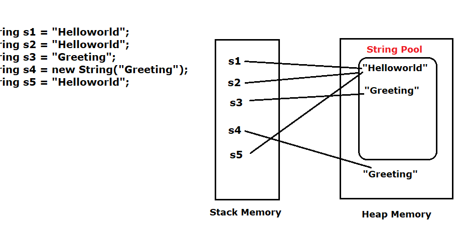
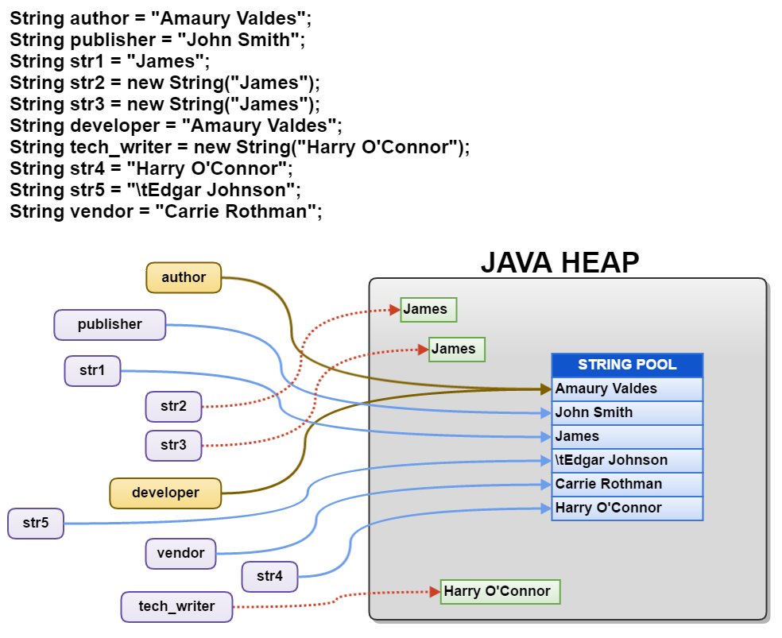
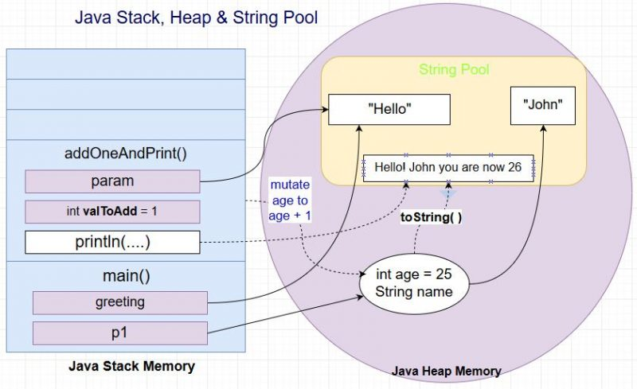
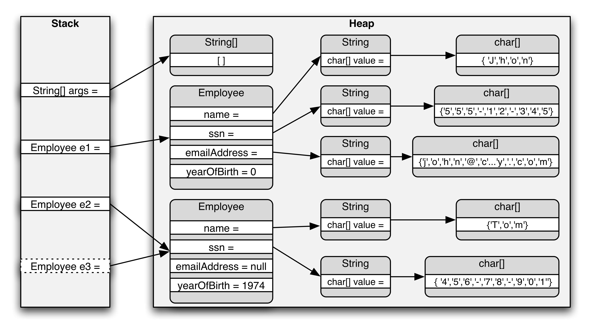
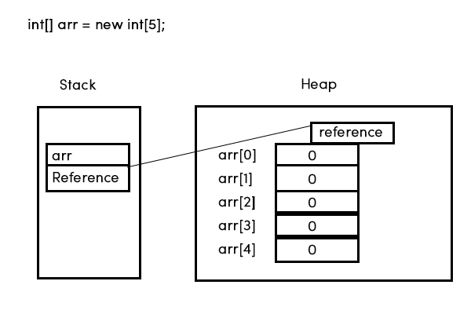
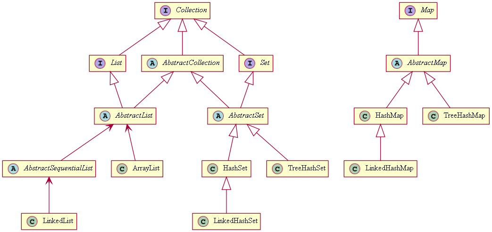

#### :house: [REVATURE workspace, HOME (`github`)](https://github.com/joedonline/REVATURE__workspace)  :house:
#### :house_with_garden: [REVATURE workspace, HOME (`delta`)](https://github.com/deltachannel/REVATURE__workspace) :house_with_garden:
---
# :calendar: [WEEK 01](https://github.com/joedonline/REVATURE__workspace/tree/master/WEEK__01)
## Thursday, Dec. 19th 2019

---
## Strings
- are Objects
- are **immutable**.
- The String class **cannot** be subclassed (it is final).
- Inside each `String` is an `array` of chars.
- Strings are stored in the **String pool**.
- Each specific `String` value only appears in the Pool once.
  * This is so that String instances can be reused & save memory.
  
  

  

  

  

---
## Arrays
- are Objects
- Each array is fixed-length and has a type
- Objects or primitives inside an array are stored sequentially for fast access

### Declaring Arrays
- Declare arrays using the `type` and `[]`
- We can specify length with `[n]`, where `n = [0,1,2,...,infinity]`
- Example: 
  * `int[10]`
  * `int[4] myArray = {3,2,1,4}`
- Use these for efficiency



---
## Enhanced `for loop`
- Works with Arrays and Iterables.
- Typical `fori`
  
  ```
  for (int i=0; i < myArray.length; i++) { ... }
  ```

- Enhanced `for`
  
  ```
  for (int v : myArray) { // do something with v }
  ```

---
## Interfaces and Abstract Classes
- Both enable abstraction (OOP) in Java
- **Neither can be instantiated.**
- Both can be parents, but
  * we **implement** Interfaces
  * and **extend** Abstract classes
- Both can (and mostly do) have abstract methods
  * (an abstract method doesn't have a body)
- A typical hierarchy includes both
- `I extends I`, `C implements I`, `C extends C`

### The Collections API

- Collections API: { `Set`, `List`, `Map` } = interfaces
  * Set, List, Map --> all cannot be instantiated!
- Abstract classes with partial implementations
  * `AbstractList`
  * `AbstractSet`
- Concrete classes
  * `ArrayList`
  * `LinkedList`
  * `HashSet`



---
## Interfaces vs. Abstract Classes

| Interfaces | Abstract Classes |
|-|-|
| You can implement multiple Interfaces | You can only directly extend **one** Abstract class |
| Methods are abstract & public (unless we change them with modifiers) | Methods can be abstract or concrete |
| Fields must be **`static`** AND **`final`**(constants) | Can have fields |
| methods can be implemented using the default modifier | Has (and **always** needs) a Constructor |
|  | In sum, they are very similar to a class |

??? ** NOTE: Non-abstract classes **cannot** have abstract methods

---
## Generics
- Parameterizes over Types
- Allows you to use different classes, each version of the class working with a different type
- Compile-time type safety
- Syntax: 
  * `List<E>`, where `E` = `Type` or `Object`
- Examples:
  * `List<Integer>`
  * `List<String>`
  * `List<Object>`
  * `List<Vehicle>`

---
## MAVEN (Apache Maven)
- Build Automation and Dependency Management Tool
- [mvnrepository.com](https://mvnrepository.com)

### Build Automation
- Maven build lifecycle:
  * **validate:** makes sure Maven project is valid
  * **compile:** compiles your code into `target/`
  * **tests:** runs any tests in `src/test/java`
  * **package:** produces a Java Archive( `*.jar` ) file to store app
  * **verify:** checks, builds, package success
  * **install:** installs this package to local Maven repository
   - on Mac: `~/.m2`
   - on Windows: `C:\Users\<username>\.m2`
  * **deploy:** installs this package in central Maven repository.
- Run these with `mvn <command>`
  * Later stages will also run earlier stages.

---
## Dependency Management
- So far, we've only used Java
- When we use Java from other devs, we get their `.jar` files via Maven
- All we need is to specify dependencies in the POM (pom.xml)
- Maven first checks local repo, then automatically downloads dependencies, if necessary

---
## Unit Testing
- Unit = Smallest functional unit, so the tiniest piece of code you can test that does something
- In practice, **always always always unit test your methods**
- Unit test by specifying what to pass into a method and what that method should return
- When we run out tests, we actually run the methd with given input and check if the output is correct
- Example:
  
  ```
  int add(int x, int y);
  "we expect add(3, 5) to return 8"

  int output = add(3, 5);
  assertTrue(output == 8);
  ```

??? **Integration Testing**
- Tests multiple pieces of code

---
## JUnit
- Unit testing framework for Java
- Easy to use, widely used
- Can also write integration tests
- Annotate our tests with `@Test`
- Specify set-up and tear-down activities using
  * `@Before` (use more often)
  * `@After` (use more often)
  * `@BeforeClass` (faster but worse)
  * `@AfterClass` (faster but worse)

---
## Mocking
- Unit tests need to test the smallest functional pieces
- We create "mock" versions of classes/methods with fixed return values
- This lets us test just one method

---
## Concrete Collections
- `ArrayList`
- `LinkedList`
- `HashSet`
- `TreeSet`
- `PriorityQueue`
- `HashMap`
- `TreeMap`
- `ArrayDeque`
- `LinkedHashSet`
- `Vector`
- `Stack`

---
## Casting
- Casting in Java is done using `(<type>)`
- We can cast with either reference or primitive types
- Casting is used to change the type of an existing reference or primitive
- Example:

  ```
  int i = 3;
  long el = (long) i; // works w/o cast

  long el = 3L;
  int i = (int) el; // requires the cast
  ```

### Casting references
- The type of a reference need not exactly match the type of the object it points to
- The rules:
  
  | Heap | points to | Stack Frame |
  |-|:-:|-|
  | Car | <-- | Vehicle v1 |
  | Vehicle |  <-- | Vehicle v2 |
  | Vehicle | <-- | Car c1 |

- Example:

  ```
  Vehicle v1 = new Car();
  Car c1 = (Car) v1; // will work

  Vehicle v2 = new Vehicle();
  Car c2 = (Car) v2; // ClassCastException

  Integer i2 = (Integer) v2; // CompilationError
  ```

  ??? **Downcasting**, **Upcasting**
  - ([Reference 1 - University of Texas](https://www.cs.utexas.edu/~cannata/cs345/Class%20Notes/14%20Java%20Upcasting%20Downcasting.htm))
  - ([Reference 2 - Edureka](https://www.edureka.co/blog/upcasting-and-downcasting-in-java/))
  - RULES:
    1. Must be in the same heirarchy (subclass or superclass)
    2. The Object on the Heap must actually be the type of reference ("is-a")
