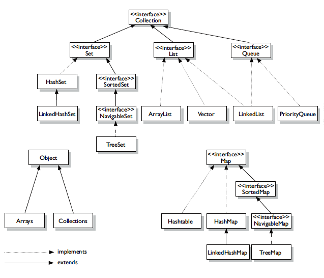

#### :house: [REVATURE workspace, HOME (`github`)](https://github.com/joedonline/REVATURE__workspace)  :house:
#### :house_with_garden: [REVATURE workspace, HOME (`delta`)](https://github.com/deltachannel/REVATURE__workspace) :house_with_garden:
---
# :calendar: [WEEK 01](https://github.com/joedonline/REVATURE__workspace/tree/master/WEEK__01)
## Friday, Dec . 20th 2019

---
## Concrete Collections
- ArrayList
- LinkedList
- HashSet
- TreeSet
- PriorityQueue
- HashMap
- TreeMap
- ArrayDeque
- LinkedHashSet
- Vector
- Stack
- HashTable

---
## Collections API
- The Collections API is a part of `java.util.*`
- It provides a uniform framework & default implementations of common data structures

### Collections API: 2 Branches
- property Collections
- Maps -- is related

### Collections API: Heirarchy 1
- `java.util.Collections`
  * A utility class for working with `java.util.Collection` objects
  * Have static methods

    

    

    

### Collections API: Heirarchy 2

  

---
## Comparable vs. Comparator
- [Edureka reference](https://www.edureka.co/blog/comparable-in-java/)

### Comparable: natural ordering implemented on objects

### Comparator: custom rules for ordering objects

---
### PRESENTATION

- ArrayList
  * extends AbstractList
  * implements
    - List<E>
    - RandomAccess
    - Cloneable
    - `java.io.Serializable`

- PriorityQueue
  * extends AbstractQueue
  * implements `java.io.Serializable`

---
## BST

---
## Red/Black (self-balancing)

---
## `Object.hashCode()`
- `HashMap`

---
### `iterator()`
- ??concurrent modification

---
## Threads
- A Thread is a single flow of execution.
- 1 Stack --> 1 Thread
  * all sharing the same Heap
- In Java, and other languages, our program can run multiple threads
  * This means your program can do more than one thing at once
  * We call this **multithreading** or **parallel** processing

### Why Threads? (Use cases)
- Speed up the program
- Multiple users, or UIs
- Multiple in/out streams
- concurrent backups for very important things
- concurrent connections (??two-way binding)
  * waiting/listening generally

### Threads in Java
- 2 ways to make a new Thread
  * Extend the Thread class & call `.start()` on that subclass.
    - In this case, we specify functionality in the subclass
    - **generally discouraged** :x:
  * Implement the `Runnable` interface & override `.run()`, then use `new Thread(myRunnable).start()`
    - specify functionallity in `run()`
    - **preferred option** :heavy_check_mark:
- In either cases, makes a new Stack with `run()` at the bottom

  

  

---
## ?? Lookup `synchronized` in Threads
- `public synchronized void expensiveCompute()`

---
## Marker Interface:
- an interface with no methods
- it doesn't ask that you implement any methods
- it just "marks" the implementating classes
- Examples:
  * `Serializable`
  * `Cloneable`
  * `RandomAccess` (especially in Collections)
