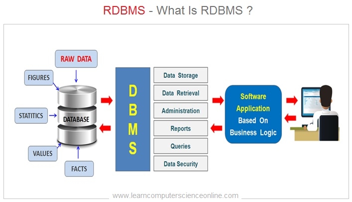
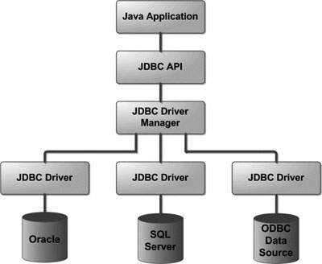

#### :house: [REVATURE workspace, HOME (`github`)](https://github.com/joedonline/REVATURE__workspace)  :house:
#### :house_with_garden: [REVATURE workspace, HOME (`delta`)](https://github.com/deltachannel/REVATURE__workspace) :house_with_garden:
---
# :calendar: [WEEK 02](https://github.com/joedonline/REVATURE__workspace/tree/master/WEEK__02)
## Thursday, Dec. 26th 2019

---
# RDBMS: Relational Database Management System
- [Study Guide - Link](https://sites.google.com/revature.com/studyguide/databasesql)
- The most **common way to persist data** in an **enterprise application**

## "Relational"
- just means dealing with "relations", which is a fancy word for tables

  

## RDBMSs
- runs on their own server
- have their own I/O

   

  

- **We persist data by communicating w/ the RDBMS using SQL** 

  

## SQL: Structured Query Language
- Used to **communicate** with RDBMSs

  

### SQL -- Split into different sublanguages for working with functionalities:
- [Study Guide - Link](https://sites.google.com/revature.com/studyguide/databasesql#h.p_O_Df70ohDyTa)
- **DML: Data Manipulation Language**
  * Used to work with actual items of data(records)
- **DDL: Data Definition Language**
  * Used to create / delete / alter *tables*
- **DCL: Data Control Language:**
  * Used to *manage users* and *permissions*
- **TCL: Transaction Control Language**
  * Used for controlling (start, stop, revert) transactions
  * **Transactions** are how we *modify* the DB
- **DQL(?): Data Query Language**
  * [REFERENCE 1](https://geekflare.com/what-is-dql/)
  * Documentum Query Language (DQL) is a language to query Documentum content management system. This, we use to create, manage, deliver, and archive all type of contents from text documents and spreadsheets to digital images, HTML, and XML components. (REFERENCE DEFINITION)   

### Transaction
- The *one word answer* to "why we use DB over file"
- Transactions with a RDBMS satisfy 4 properties (ACID)   

### 4 Properties of Transactions (ACID)
 * Atomic Transactions
    - Transactions succeed or fail as one unbroken unit   
 * Consistent Transactions
    - Takes the DB from one valid state to another
    - Valid state means following one rule: *constraints*   
 * Isolated Transactions
    - Transactions takes place in parallel without interfering with each other   
 * Durable Transactions
    - Transactions persist even through catastrophe (??? ways to either complete or ROLLBACK the transaction)   

### Vendors and Dialects
- Multiple orgs have written RDBMSs, we call these "vendors"
- Each vendor has their own dialect of SQL, even though "all should" support base SQL. ???
- We'll be learning Postgres/PostgreSQL
- Other vendors: Oracle, MySQL, Server SQL, MariaDB, ...
- There are also many NoSQL database
  

### SQL Statements: Control Keywords / Commands
- [Study Guide - Link](https://sites.google.com/revature.com/studyguide/databasesql#h.p_O_Df70ohDyTa)
- **DML** --> `INSERT`, `DELETE`, `UPDATE`
  * (and depending on the case) `SELECT`
- **DDL** --> `CREATE`, `ALTER`, `DROP`
  * Also `TRUNCATE` (in Oracle, not in Postgres) *not used often but interesting to know*
- **DCL** --> `GRANT`, `REVOKE`
- **TCL** --> `BEGIN`, `SAVEPOINT`, `COMMIT`, `ROLLBACK`
- **DCL** in/and/or **DQL** --> `SELECT`
  

### SQL Tool
- [DBeaver](https://dbeaver.io/download) ??? DOWNLOAD AND INSTALL !!!!
  

---
## `SELECT` Clauses

| Keyword | Clauses | Description
|-|-|-|
| `SELECT` | `<columns or *>` | The [SQL SELECT](https://sites.google.com/revature.com/studyguide/databasesql#h.p_zS24Tk7OET-Q) statement is used to fetch the data from a database table which returns this data in the form of a result table. These result tables are called result-sets. |
| `FROM` | `<table>` | Pick table to get records from. Can specify database and schema: `database.schema.table` |
| `WHERE` | `<condition>` | filters records based on a condition: i.e. `height >= 3` |
| `GROUP BY` | `<column or expression>` | Separates records into groups and aggregates within group |
| `HAVING` | `<condition>` | Filters groups based on a condition: i.e. `pop >= 100,000` |
| `ORDER BY` | `<column or expression>` | Orders results |

  

---
### `ALTER TABLE`
- The `SQL ALTER TABLE` command is used to add, delete or modify columns in an existing table. 
- You should also use the `ALTER TABLE` command to add and drop various constraints on an existing table.
- [TutorialsPoint Reference](https://www.tutorialspoint.com/sql/sql-alter-command.htm)

 

#### `ALTER TABLE` Syntax

| Description | Query |
|-|-|
| The basic syntax of an ALTER TABLE command to add a New Column in an existing table is as follows. | `ALTER TABLE table_name ADD column_name datatype;` |
| The basic syntax of an ALTER TABLE command to DROP COLUMN in an existing table is as follows. | `ALTER TABLE table_name DROP COLUMN column_name;` |
| The basic syntax of an ALTER TABLE command to change the DATA TYPE of a column in a table is as follows. | `ALTER TABLE table_name MODIFY COLUMN column_name datatype;` |
| The basic syntax of an ALTER TABLE command to add a NOT NULL constraint to a column in a table is as follows. | `ALTER TABLE table_name MODIFY column_name datatype NOT NULL;` |
| The basic syntax of ALTER TABLE to ADD UNIQUE CONSTRAINT to a table is as follows. | `ALTER TABLE table_name;`   `ADD CONSTRAINT MyUniqueConstraint UNIQUE(column1, column2...);` |
| The basic syntax of an ALTER TABLE command to ADD CHECK CONSTRAINT to a table is as follows. | `ALTER TABLE table_name`   `ADD CONSTRAINT MyUniqueConstraint CHECK (CONDITION);` |
| The basic syntax of an ALTER TABLE command to ADD PRIMARY KEY constraint to a table is as follows. | `ALTER TABLE table_name`   `ADD CONSTRAINT MyPrimaryKey PRIMARY KEY (column1, column2...);` |
| The basic syntax of an ALTER TABLE command to DROP CONSTRAINT from a table is as follows. | `ALTER TABLE table_name`   `DROP CONSTRAINT MyUniqueConstraint;` |

  

---
### Database Practice

## Comic

| id | title | author_id | genre_id | page_count | cost | rating |
|-|-|-|-|-|-|-|
|  |||||||

---
## PostgreSQL Documentation
- [Docs Link](https://postgresql.org/docs)

---
## SQL Tools
- [SQLBolt](#tbd)

--- 
## DAO: Data Access Object (design pattern)
- a single object responsible for getting data from outside the app.
- big picture -- ??? lookup "The Flying Buttress"

  

  

  

---
## JDBC: Java DataBase Connectivity
- is a standard Java API for database-independent connectivity between the Java programming language and a wide range of databases.
- Uniform interface, implementations differ based on drivers/vendors
  

  

  

### Central Interfaces:
- **Connection** 
  * represents a connection to a DB. A "session".
- **Statement**
  * represents a SQL statement
  * used for querying DB and retrieve `ResultSets`
- **ResultSets**
  * represents the 'results' retrieved from DB
- **PreparedStatement**
  * a statement which only allows values to be filled. ***Prevents SQL Injection***
  * Compiled in Java rather than by DB
    

### Common JDBC Components
#### The JDBC API provides the following interfaces and classes:
- **DriverManager:** This class manages a list of database drivers. Matches connection requests from the java application with the proper database driver using communication sub protocol. The first driver that recognizes a certain subprotocol under JDBC will be used to establish a database Connection.
- **Driver:** This interface handles the communications with the database server. You will interact directly with Driver objects very rarely. Instead, you use DriverManager objects, which manages objects of this type. It also abstracts the details associated with working with Driver objects.
- **Connection:** This interface with all methods for contacting a database. The connection object represents communication context, i.e., all communication with database is through connection object only.
- **Statement:** You use objects created from this interface to submit the SQL statements to the database. Some derived interfaces accept parameters in addition to executing stored procedures.
- **ResultSet:** These objects hold data retrieved from a database after you execute an SQL query using Statement objects. It acts as an iterator to allow you to move through its data.
- **SQLException:** This class handles any errors that occur in a database application.

##### [JDBC Online Reference](https://www.tutorialspoint.com/jdbc/jdbc-introduction.htm)
