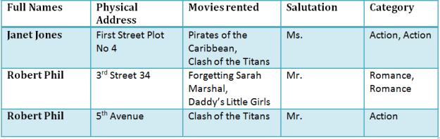
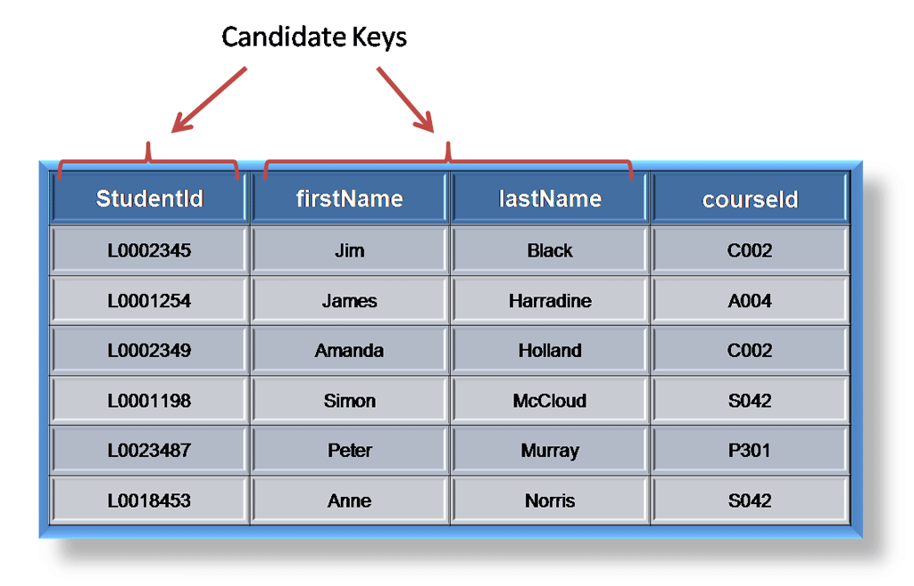
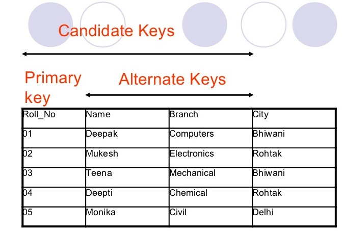
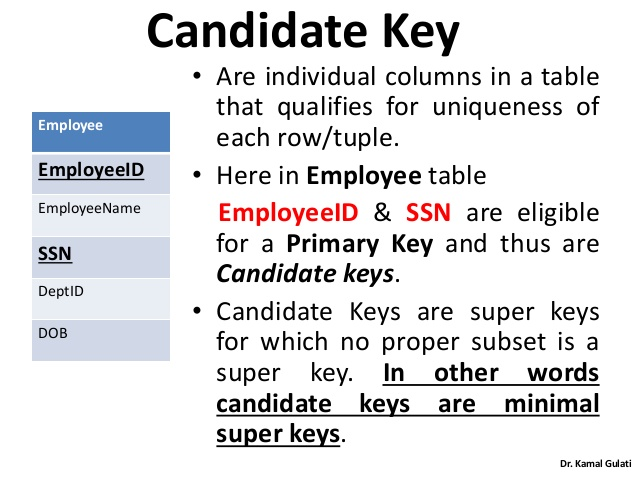
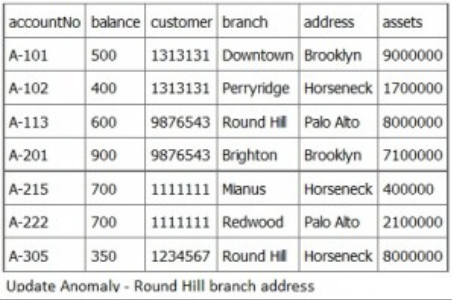
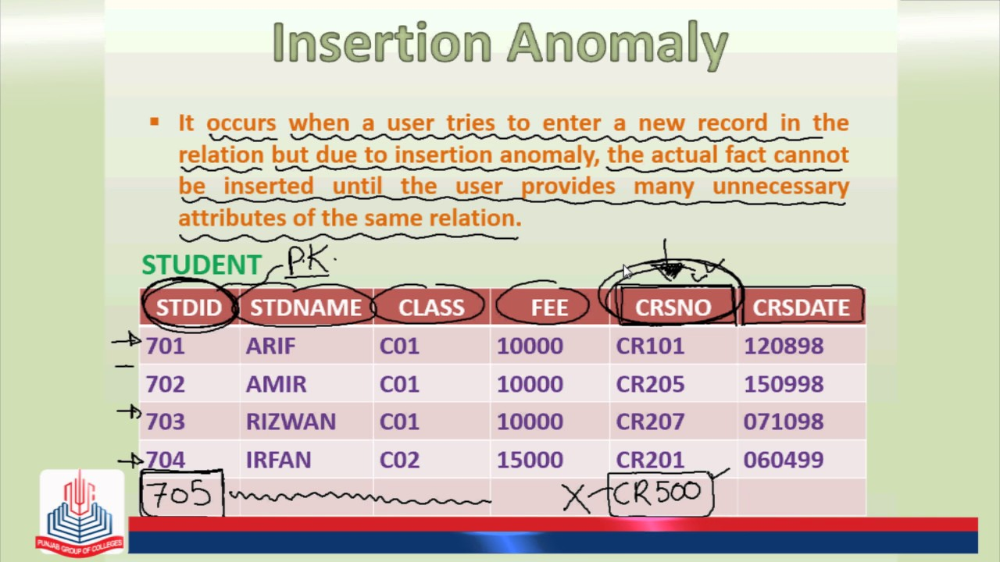

#### :house: [REVATURE workspace, HOME (`github`)](https://github.com/joedonline/REVATURE__workspace)  :house:
---
# :calendar: [WEEK 02](https://github.com/joedonline/REVATURE__workspace/tree/master/WEEK__02)
## Friday, Dec. 27th 2019

---
## RDS: Relational Database Service
- The Amazon Relational Database Service (RDS) enables developers to create and manage relational databases in the cloud.
- [REFERENCE - sumologic.com](https://www.sumologic.com/insight/what-is-amazon-rds/)

<br><br>

---
## Relational Databases

<br>

  

<br><br>

## Relational Database Table Structure: Normalized Tables

### What is Normalization?
- Normalization is a database design technique which organizes tables in a manner that reduces redundancy and dependency of data.
- It divides larger tables to smaller tables and links them using relationships.
- [REFERENCE - guru99](https://www.guru99.com/database-normalization.html)

<br>

  

<br>

  

<br><br>

#### Without Normalization

  

<br><br>

## Database Normal Forms

### 1NF (First Normal Form) Rules
- Each table cell should contain a single value.
- Each record needs to be unique.

<br>

  Example

  

<br><br>

#### What is a KEY?
- A KEY is a value used to identify a record in a table uniquely.
- A KEY could be a single column or combination of multiple columns

<br>

##### ** Note: Columns in a table that are NOT used to identify a record uniquely are called non-key columns.

<br><br>

#### What is a Candidate Key?
- A candidate key is a column, or set of columns, in a table that can uniquely identify any database record without referring to any other data. ([ REFERENCE ](https://www.techopedia.com/definition/21/candidate-key))
- Each table may have one or more candidate keys. If one candidate key is unique, and it is called the primary key.

<br>

  

<br>

  

<br>

  

<br><br>

#### What is a Primary Key?
- A primary key is a single column value used to identify a database record uniquely.
- A Candidate Key that we decide to actually use to represent/identify each record in the table
- **In practice**, we use an `id` column generated to be a PK

<br>

**It has following attributes:**
- A primary key cannot be NULL
- A primary key value must be unique
- The primary key values should rarely be changed
- The primary key must be given a value when a new record is inserted.

<br><br>

#### What is Composite Key?
- A composite key is a primary key composed of multiple columns used to identify a record uniquely
- When a key is composed of more than one column, it is known as a composite key ([ Reference - techopedia ](https://www.techopedia.com/definition/21/candidate-key)).

<br>

  

<br><br>

### 2NF (Second Normal Form) Rules
- Rule 1- Be in 1NF
- Rule 2- Single Column Primary Key

<br>

  

<br>

#### Database - Foreign Key

- Foreign Key references the primary key of another Table! 
- It helps connect your Tables

<br>

**What a Foreign Key does**
- A foreign key can have a different name from its primary key
- It ensures that rows in one table have corresponding rows in another
- Unlike the Primary key, they do not have to be unique. Most often they aren't
- Foreign keys can be null even though primary keys can not

<br>

  

<br>

#### Why do you need a foreign key?

  

<br>

#### What are transitive functional dependencies?
- A transitive functional dependency is when changing a non-key column, might cause any of the other non-key columns to change.

<br>

  

<br><br>

### 3NF (Third Normal Form) Rules
- Rule 1- Be in 2NF
- Rule 2- Has no transitive functional dependencies

<br>

**3NF Example**

  

<br>

- We have again divided our tables and created a new table which stores Salutations. 
- There are no transitive functional dependencies, and hence our table is in 3NF
- In Table 3 Salutation ID is primary key, and in Table 1 Salutation ID is foreign to primary key in Table 3

<br>

#### Functional Dependence:
- A relationship between two pieces of data.
- One of which is dependent on the other.
- *also things we should try to avoid*

  `X depends on Y` --> If we know `Y`, then we know `X`

<br><br>

## Other Database Normal Forms

### Boyce-Codd Normal Form (BCNF)
- Even when a database is in 3rd Normal Form, still there would be anomalies resulted if it has more than one Candidate Key.
- Sometimes is BCNF is also referred as 3.5 Normal Form.

<br>

### 4NF (Fourth Normal Form) Rules
- If no database table instance contains two or more, independent and multivalued data describing the relevant entity, then it is in 4th Normal Form.

<br>

### 5NF (Fifth Normal Form) Rules
- A table is in 5th Normal Form only if it is in 4NF and it cannot be decomposed into any number of smaller tables without loss of data.

<br>

### 6NF (Sixth Normal Form) Proposed
- 6th Normal Form is not standardized yet. However, it is being discussed by database experts for some time. Hopefully, we would have a clear & standardized definition for 6th Normal Form in the near future...

<br><br>

### Why Normalize? Anomalies
- *Anomalies are things we try to avoid*

<br>

#### What are Anomalies?
- Anomalies are problems that can occur in poorly planned, un-normalised databases where all the data is stored in one table (a flat-file database).
- [REFERENCE - data anomalies](http://jhigh.co.uk/Higher/dbases/anomalies.html)

<br>

### The Three Anomalies (+ 1)

#### Update anomaly
- [ REFERENCE - Fandom ](https://databasemanagement.fandom.com/wiki/Category:Data_Anomalies) -  An update anomaly is a data inconsistency that results from data redundancy and a partial update. For example, each employee in a company has a department associated with them as well as the student group they participate in.
- **Classroom definition** - A piece of data is updated in one location and not another.

  <br>

  **Example 1**

  | Movie | Actor/Actress |
  |-|-|
  | Gone With The Wind | Vivian Leigh |
  | Waterloo Bridge | Vivian Leigh |
  
  <br>

  **Example 2**

  

  <br><br>

#### Deletion anomaly
- [ REFERENCE - opentextbc ](https://opentextbc.ca/dbdesign01/chapter/chapter-10-er-modelling/) - A deletion anomaly occurs when you delete a record that may contain attributes that shouldn’t be deleted.
- a piece of data cannot be deleted without also deleting other data.

  | Movie | Actor/Actress | Height |
  |-|-|-|
  | ~~Gone With The Wind~~ | ~~Vivian Leigh~~ | ~~6~~ |
  | ~~Waterloo Bridge~~ | ~~Vivian Leigh~~ | ~~6~~ |
  | Gladiator | Russell Crowe | 7 |

  <br>

#### Insertion anomaly
- When inserting vital data into the database is not possible because other data is not already there. ([ REFERENCE ](https://databasemanagement.fandom.com/wiki/Data_Anomalies))
- This occurs when a user tries to enter a new record but the record cannot be added until the user provides many unnecessary attributes of the same relation.

  <br>

  

  <br>

#### ** Creation anomaly 
- a piece of data cannot be added without also providing other (potentially `NULL`) data

  | Movie | Actor/Actress | Height |
  |-|-|-|
  | ~~Gone With The Wind~~ | ~~Vivian Leigh~~ | ~~6~~ |
  | ~~Waterloo Bridge~~ | ~~Vivian Leigh~~ | ~~6~~ |
  | Gladiator | Russell Crowe | 7 |
  | Forrest Gump | Tom Hanks | `NULL` |

  <br><br>

---
#### *CLASSROOM NOTES****

### Candidate Key:
- Any column of combination of columns that uniquely identifies all records in a table.
- All other columns functionally depend on the Candidate key.
- There may be more than one Candidate key.
- Must a minimal combo ??? column(s)

  | Course Num | Dept. | Prof. |
  |-|-|-|
  | HUM 303 | Humanities | Smith |
  | PHIL 500 | Philosophy | Jones |
  | LIT 102 | Literature | Jones |

  * What is a good Candidate key for the above table? 
    - ans: `Course Num`
  <br><br>

  | Topic | Course Num | Dept. | Prof. |
  |-|-|-|-|
  | Books | HUM 303 | Humanities | Smith |
  | Pamphlets | PHIL 500 | Philosophy | Jones |
  | Other Books | LIT 102 | Literature | Jones |
  | Articles | PHIL 500 | Philosophy | Smith |

  * What is a good Candidate key for the above table? 
    - ans: `Topic` --> since it contains **unique** values
  <br><br>

### Composite Key
- A candidate key made of multiple columns
<br><br>

### Normalization
- Solves our anomalies (C, U, D)
- Tolerant of changes to the data model
- Reduces redundancy
- Comes in multiple "levels", we say *forms*
<br><br>


#### 1st Normal Form
- [Memory Marker] "The key"
- Each record must be unique
- There must be a Candidate Key
- **Values must be atomic**
  * A phone number is ok
  * A list of phone numbers is not
  <br><br>

#### 2nd Normal Form
- [Memory Marker] "The whole key"
- All non-Candidate-key columns must depend on the **entirety** of every candidate key.
- If there are no composite keys:
  
  1st Normal Form --> 2nd Normal Form
<br><br>

#### 3rd Normal Form
- [Memory Marker] "..and nothing but the key"
- No non-Candidate-key column depends on any other non-Candidate-key column

  | `CityId` | `City` | `State` | `Over200Target` | `Sales` |
  |-|-|-|-|-|
  | 1 | Savannah | GA | No | 200 |
  | 2 | Springfield | IL | Yes | 500 |
  | 3 | Louisville | KY | Yes | 300 |
  | 4 | NYC | NY | No | 199 |

  <br><br>

  **Non-3rd Form** ???
  
  | id | title | mediatype | price |
  |-|-|-|-|
  | 1 | Mulan OST | Casette | 0.50 |
  | 2 | Paint In Black | Casette | 0.50 |
  | 3 | Up | DVD | 2.00 |
  | 4 | GWTW | DVD | 2.00 |

  <br><br>

### Foreign Key
- A reference to the Primary Key of another table, used to link records together in a `JOIN`
  <br><br>

---
### EXAMPLES

| `City Id` | `City` | `State` | `Region` | `Sales` |
|-|-|-|-|-|
| 1 | Savannah | GA | South | 200 |
| 2 | Springfield | IL | Midwest | 500 |
| 3 | Louisville | KY | Midwest | 300 |
| 4 | NYC | NY | NorthEast | 199 |

- Primary Key: City Id
- Candidate Key(s): City, State, City Id
<br><br>

---
## Joins
- Joins combine records from 2+ tables.
- The result of a Join will have columns from all involved tables.

<br>

#### Joins ([ Study Guide reference ](https://sites.google.com/revature.com/studyguide/databasesql#h.p__Y6lnTqvLLN0))
- The SQL Joins clause is used to combine records from two or more tables in a database.
- A JOIN is a means for combining fields from two tables by using values common to each.

<br><br>

### To specify a Join:
- We need a **Join condition** and the **Join type**.
- There may/will be multiple ways to achieve the same result

<br><br>

### Join Condition
- Boolean expression (`true` or `false`)
- Typically makes use of information from one record in `Table A` and one in `Table B`
- When the Join Condition is `true`, the two records are combined and included in the output

<br><br>

### Join Types
- **`INNER`** 
  * Do nothing else, only the join condition matters. <br><br>
- **`LEFT OUTER`** 
  * Add one record to the output for each record in the `LEFT` table that doesn't yet appear in the output. <br><br>
- **`RIGHT OUTER`**
  * Replace `LEFT` with `RIGHT` above <br><br>
- **`FULL OUTER`**
  * Both a `RIGHT` and `LEFT OUTER JOIN` <br><br>

  

  <br><br>

**Widgets**

| widget_id | widget_size | car_id |
|-|-|-|
| 100 | 20 | 2 |
| 200 | 20 | 1 |
| 300 | 40 | 3 |

<br>

**Cars**

| car_id | model |
|-|-|
| 1 | Jetta |
| 2 | Prius |
| 3 | F150 |

<br>

| condition | type |
|-|-|
| `widgets.car_id = cars.car_id` | `INNER` |
| `widget_size <= 20` | `INNER` |
| `widget_size <= 20` | `LEFT OUTER` |
| `widget_size <= 20` | `RIGHT OUTER` |
| `(2 + 3) > 6` | `RIGHT OUTER` |

<br>

### Output of above `JOIN`

`INNER` @ `widgets.car_id = cars.car_id`

| widget_id | widget_size | widgets.car_id | cars.car_id | model |
|-|-|-|-|-|
| 100 | 20 | 2 | 2 | Prius |
| 200 | 20 | 1 | 1 | Jetta |
| 300 | 40 | 3 | 3 | F150 |

<br><br>

`INNER` @ `widget_size <= 20`

| widget_id | widget_size | widgets.car_id | cars.car_id | model |
|-|-|-|-|-|
| 100 | 20 | 2 | 1 | Jetta |
| 100 | 20 | 2 | 2 | Prius |
| 100 | 20 | 2 | 3 | F150 |
| 200 | 20 | 1 | 1 | Jetta |
| 200 | 20 | 1 | 2 | Prius |
| 200 | 20 | 1 | 3 | F150 |

<br><br>

`LEFT OUTER` @ `widget_size <= 20`

| widget_id | widget_size | widgets.car_id | cars.car_id | model |
|-|-|-|-|-|
| 100 | 20 | 2 | 1 | Jetta |
| 100 | 20 | 2 | 2 | Prius |
| 100 | 20 | 2 | 3 | F150 |
| 200 | 20 | 1 | 1 | Jetta |
| 200 | 20 | 1 | 2 | Prius |
| 200 | 20 | NULL | NULL | F150 |

<br><br>

`RIGHT OUTER` @ `widget_size <= 20`

| widget_id | widget_size | widgets.car_id | cars.car_id | model |
|-|-|-|-|-|
| 100 | 20 | 2 | 1 | Jetta |
| 100 | 20 | 2 | 2 | Prius |
| 100 | 20 | 2 | 3 | F150 |
| 200 | 20 | 1 | 1 | Jetta |
| 200 | 20 | 1 | 2 | Prius |
| 200 | 20 | 1 | 3 | F150 |

<br><br>

`RIGHT OUTER` @ `(2 + 3) > 6`

| widget_id | widget_size | widgets.car_id | cars.car_id | model |
|-|-|-|-|-|
| NULL | NULL | NULL | 1 | Jetta |
| NULL | NULL | NULL | 2 | Prius |
| NULL | NULL | NULL | 3 | F150 |
| 100 | 20 | 2 | NULL | NULL |
| 200 | 20 | 1 | NULL | NULL |
| 300 | 40 | 3 | NULL | NULL |

<br><br>

### INNER JOIN Syntax

```
Widgets INNER JOIN
Cars ON <join condition>
```

<br><br>

---
## MULTIPLICITY
- `Multiplicity = Cardinality + Participation`
- [StackOverflow Reference](https://stackoverflow.com/questions/17877582/multiplicity-vs-cardinality)

<br>

##### Simply put:
- **Multiplicity** is made up of a *lower* and an *upper* cardinality.
- **Cardinality** is *how many elements* are in a set.
- Thus, Multiplicity tells you the minimum and maximum allowed members in the set. 
- ***Multiplicity and Cardinality are not synonymous.***
- [StackOverflow Reference](https://stackoverflow.com/questions/17877582/multiplicity-vs-cardinality)

<br>

#### Cardinality
- Denotes the maximum number of possible relationship occurrences in which a certain entity can participate in (in simple terms: at most).
- [StackOverflow Reference](https://stackoverflow.com/questions/17877582/multiplicity-vs-cardinality)

<br>

#### Participation
- Denotes if all or only some entity occurrences participate in a relationship (in simple terms: at least).
- [StackOverflow Reference](https://stackoverflow.com/questions/17877582/multiplicity-vs-cardinality)

<br><br>

---
#### *CLASSROOM NOTES***

## Multiplicity
- Refers to the cardinality

### Multiplicities
- One-to-many
- Many-to-one
- Many-to-many
- One-to-one

  <br>

| Multiplicities | Table & Foreign Key Setup |
|-|-|
| 1 to 1 | Can be same table |
| 1 to n | Two tables, Foreign Key on many side |
| n to n | Three tables (one **junction** table); two Foreign Keys on junction table |

<br><br>

  

  

<br><br>

  #### MULTIPLICITY EXAMPLE

  **Playlists**

  | id | name |
  |-|-|
  | 1 | Mixtape '06 |
  | 2 | Jamz |

  <br>

  **Tracks**

  | id | name |
  |-|-|
  | 1 | trouble |
  | 2 | problems |
  | 3 | sorrows |

  <br>

  **`Playlist_Track`**

  | `p_id` | `t_id` |
  |-|-|
  | 1 | 1 |
  | 1 | 3 |
  | 2 | 2 |
  | 2 | 3 |

<br><br>

---
### PRACTICAL EXERCISE: Interactive SQL
- [SQLBolt - REFERENCE](https://sqlbolt.com/)
<br><br>

---
## ( [To Watch: Programming Foundations: Databases](https://www.lynda.com/SQL-tutorials/Programming-Foundations-Databases/784293-2.html) )
