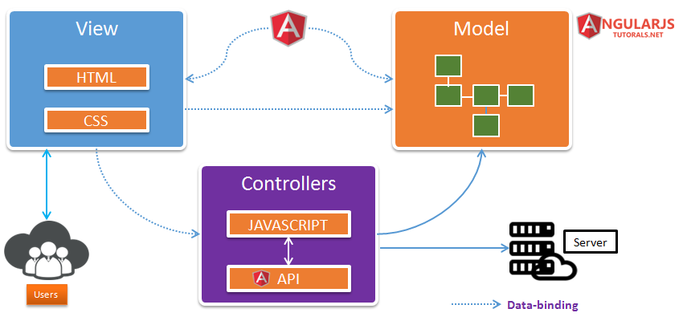
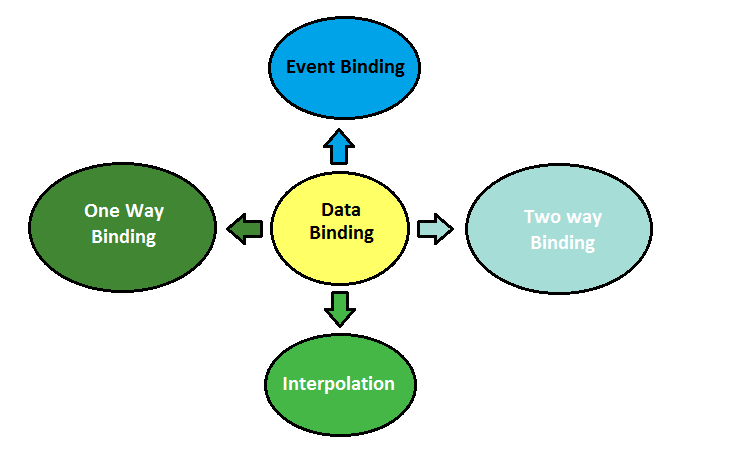

#### :house: [REVATURE workspace, HOME (`github`)](https://github.com/joedonline/REVATURE__workspace)  :house:
---
# :calendar: [WEEK 05](https://github.com/joedonline/REVATURE__workspace/tree/master/WEEK__nn)
## Thursday, Jan. 16th 2020

---
## MVC: Model-View-Controller Design Pattern
- **Model:** in Angular, the `.ts` class
- **View:** in Angular, the `.html` template
- **Controller:** gets relevant info from model, builds view using that info, and sends view to client
- Angular uses this pattern with every component
- We use *data binding* to bind values in the model to the **view**, so Angular can update the view dynamically.

<br>

**Diagram 1**


<br>

**Diagram 2**



<br>


<br><br>

### Types of Data Binding in Angular
- `{{ }}` - interpolation
- `( )` - event binding
- `[ ]` - attribute binding
- `[(  )]` - two-way data binding

<br>



<br><br>

---
## Services
- Make use of Dependency Injection (DI)
- Angular instantiates your services and passes them in to components as necessary

  <br>

  * #### DI Primer

    **1**

    ```
    class myDependent {
      myDependent(MyDependency myDependency) {
        this.myDependency = myDepency;
      }
    }
    ```

    **2**

    ```
    new MyDependent(new MyDependency());
    ```

    <br>

    * *NOTE:* 
      - When using Angular, we don't do #2
      - The framework itself instantiates and injects our dependencies

    <br>

- We use Services to share state and behavior across disparate components
- We use a `userService` to share user info between "user-summary" and "user-greeting"

<br><br>

---
## `ng` commands
- `ng new --skip-tests --inline-style --routing myproject`
- `ng new --routing --skip-tests myproject`
- `ng generate component name-of-component`
- `ng generate service name-of-service`
- `ng generate class Comic`

<br><br>

---
## `@Input` and `@Output`
- These decorators mark fields in your components whose values can be passed in by a parent (`@Input`) or passed out to a parent (`@Output`)
- Parent components use attribute binding to pass values into child components
- Parent components use event binding to receive output from child components

**Example** inside parent template:

  ```
  <app-child 
    [myInput]="passedIn" 
    (myOutput)="handle(myOutput)" />
  ```
