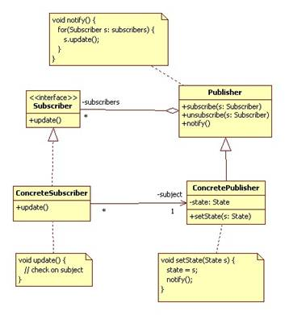

#### :house: [REVATURE workspace, HOME (`github`)](https://github.com/joedonline/REVATURE__workspace)  :house:
---
# :calendar: [WEEK 05](https://github.com/joedonline/REVATURE__workspace/tree/master/WEEK__05)
## Friday, Jan. 17th 2020

---
## Observer and Publisher/Subscriber Design Patterns
- Both are used to pass messages to one or more receivers
- The receivers "sign up" to receive messages, they subscribe
- In the Observer pattern, listeners subscribe directly to the source of messages.

### In the Publisher/Subscriber Pattern
- Listeners subscribe to a channel. Multiple `message.producers` (Publishers) can write to the same channel

  

---
  

**Observer Pattern**

  

**Publisher/Subscriber Pattern**

  

**Subject-Publisher**

  

---
## HTTP in Angular
- Makes use of `HttpClient` from HttpClient Module
- Should happen through a Service
- Responses come in the form of an Observable.
- We subscribe to the Observable to process the response. This works much like `.then()` and `.catch()`.

 

---
## 3 Types of Directives
- Components
- Structural: `*ngFor`, `*ngIf`
- Attribute: `routerLinkActive` -- lets you add a class to a routed element when its routerLink is active

  

---
## XML: Extensible Markup Language
- A markup language with elements and attributes like HTML. Where HTML is only used for *hypertext*, and XML can be extended and used for many purposes.
- Often used for configuration files.

 

### Well-formed XML
- Consists of valid tag structure.
- Obey rules on always having a closing tag
 for each opening tag.
- Elements are nested legally.

 

### Valid XML
- is well-formed and follows the structure defined in a `DTD`(Document Type Descriptor), and (if necessary) uses the elements defined in an XMLNS
- **DTD-Document-Type:**
  * Specifies the structure of an XML document
- **XML Name Space:** provides defined elements for use in XML document.
