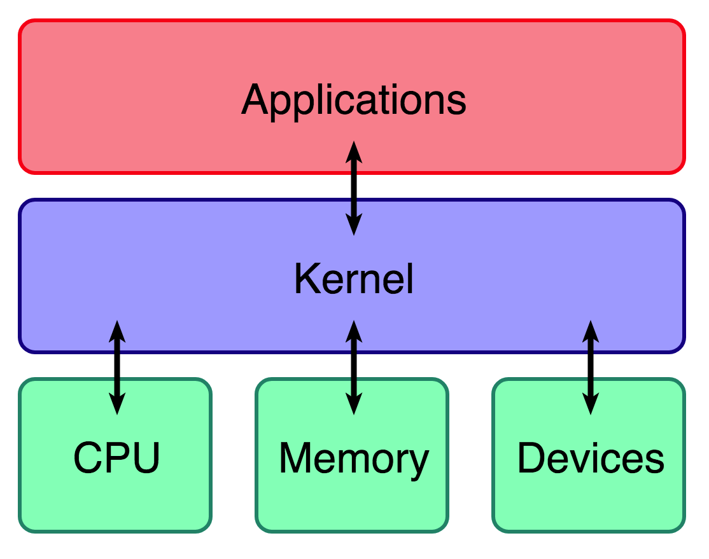
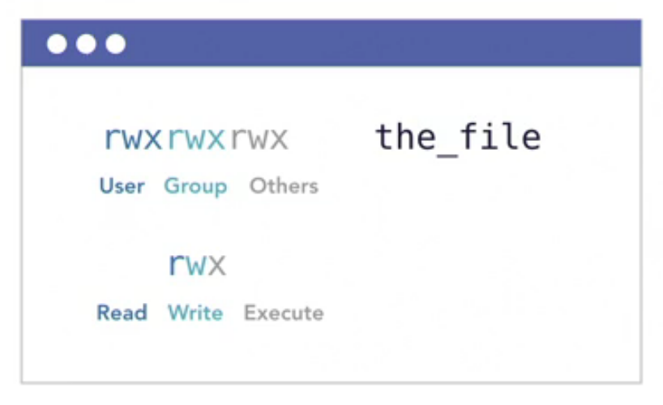
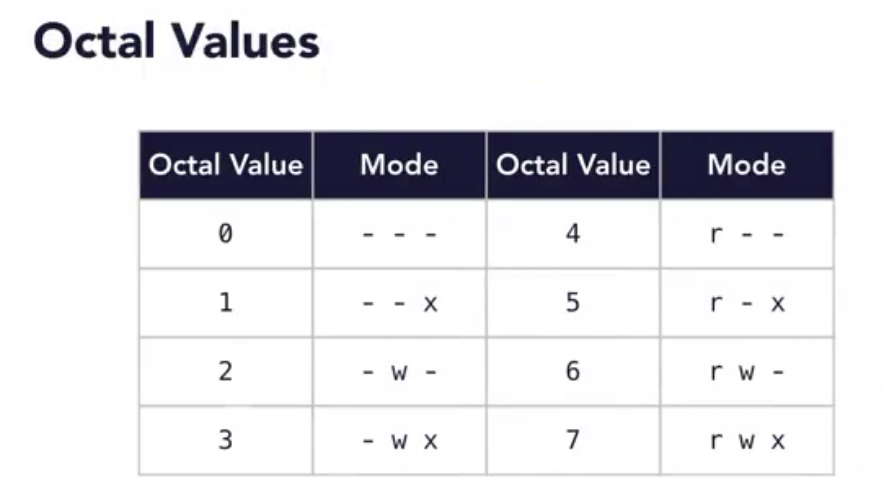
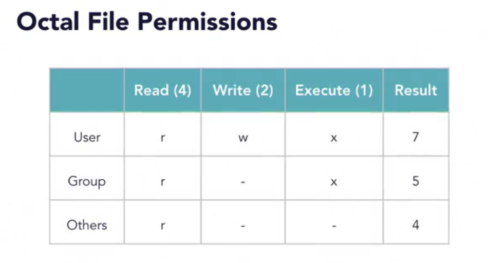
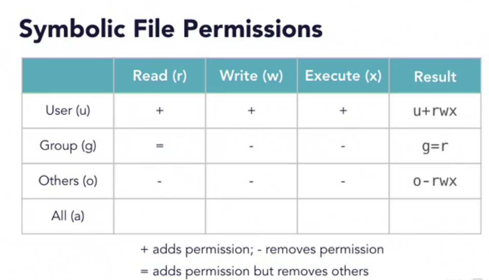
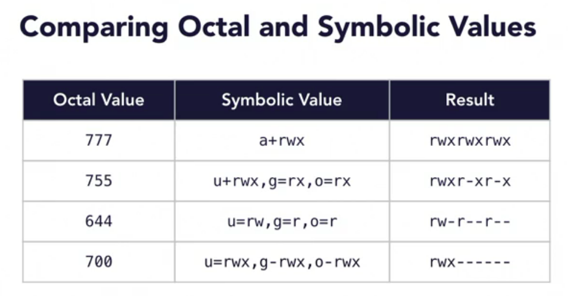
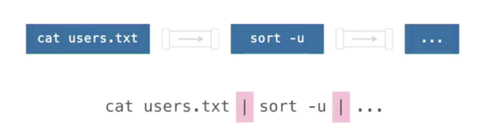

# Learning Linux Commandline

 

---
### commandlinebasics
Exercise Files for the Learning Linux Command Line course at [LinkedIn Learning](http://bit.ly/lil-llcl) and [Lynda.com](http://bit.ly/lynda-llcl).

---

 

## Kernel (operating system)
- The **kernel** is a computer program at the core of a computer's operating system with complete control over everything in the system.
- It is the portion of the operating system that is always resident in memory.
- It facilitates interactions between hardware and software components.
- [REFERENCE: wikipedia](https://en.wikipedia.org/wiki/Kernel_(operating_system))

 

  

 

---
## 1. Setting Up Your Environment

- #### Following along on a Mac
  * ###### macOS is derived from BSD/UNIX(Berkeley Software Distribution), not from Linux
  * ###### Has similar, but not identical, tool chains
  * ###### But it includes Bash shell

  

---
## 2. Command-Line Basics

- #### Shortcuts
  * `Ctrl + a`
  * `Ctrl + e`
  * `Ctrl + k`
  * `Ctrl + u`
  * `Ctrl + y`
  * `Ctrl-Shift + c`
  * `Ctrl-Shift + v`
  * Type a letter, then press tab

 

- #### Finding help commands
  * `man`
  * `<command> --help`
  * `help` by itself
  * If you don't know the command you're looking for:
    - Helps with searching a command when you don't know its name
    - `apropos "what some command does"`
    - Example: `apropos "list"`

  

---
## 3. Files, Folders, and Permissions

- #### Files, folders, and navigation
  * `file myFile.txt` - determines file type
  * `stat myFile.txt` - display ownership, modification info, etc.
  * `ls`
    - `ls -l`
    - `ls -lh`
  * `cp`
    - `cp -R`
  * `rm`
    - `rm -r`
  * `rmdir` - only on empty directories
     

- #### Find files from the command line
  * `find . -name "poe*"` - find a file by name starting with 'poe'

     

- #### User roles and sudo
  * `sudo` - lets you "borrow" superuser privileges, since root privileges are disabled by default
  * `sudo ls /`
  * `sudo -k` - good practice to execute after performing a `sudo` command, basically resets of "gives up" the *borrowed* superuser privileges in the prior executed commands
  * `super -s` - switch to super user -- USE WITH CAUTION.

    

- #### File permissions
  
  

   

  * `chmod`
    - Change the permissions on a file by modifying the file mode bits
        

  * Two methods to represent permissions
    - Octal (e.g. 755, 644, and 777)
    - Symbolic (e.g. a=r, g+w, and o-x)

     

    

     

    

     

    

     

    

    

  * ### 4 = Read; 3 = Write; 1 = Execute;
    - Most pts you can have is 7 for `rwx` ::: 8 being at index 7
    - `rwx` = 8 (- 1, due to indexing) = 7 -- read-write-execute privileges
    - `rw-` = 8 - 1 = 7 (- 1, due to indexing) = 6 -- read and write only
    - `r--` = 8 - 3 - 1 (- 1, due to indexing) = 3 -- read only

    

  * Practice:
    - `chmod 644 test.sh` -- octal notation -- removes Read from user, group, and others
    - `chmod a-x test.sh` -- symbolic notation -- removes execute from all

     

  * `sudo chown root test.sh` - change ownership of test.sh to root

  

---
## Common Command-Line Tasks and Tools

- #### Use pipes to connect commands together
  * ### Pipes
    - Take the output of one command and send it to another
    - `|` symbol

     

  

     

  * Examples:
    - `echo "hello" | wc` (`wc` = word count)
      * Output: `1  1  6` -- 1 line, 1 word, 6 characters
    - `echo "hello world from the command line" | wc`
      * Output: `1 6 34` -- 1 line, 6 words, 34 characters

 

- #### View text files with `cat`, `head`, `tail`, and `less`
  * `cat` 
    - concatenate, but often used to print contents to the screen
    - can be used to output text file contents into a series of pipe commands
     

  * `head, tail`
    - view lines from the beginning or end of a file
    - `head -n5 poems.txt` - show the first 5 lines
    - `tail -n3 poems.txt` - show the last 3 lines
     

  * `cat poems.txt | cat -n` - show all lines, and show line numbers
  * `cat poems.txt | cat -n | tail -n5` - show lines, with line numbers, last 5 lines

   

  * `less`
    - paginates text and provides navigation controls
    - Examples:
      * `less poems.txt`
       

- #### Search for text in files and streams with `grep`
  * The `grep` tool searches text or files for a given string or pattern of text.
    - given string can be text or regular expressions
     

  * `grep "the" poems.txt` -- prints the content with every occuring "the" highlighted
  * `grep -n "the" poems.txt` -- same as above, but with line numbers
  * `grep "The" poems.txt` -- search all occurences with capitalize "The" in the text
  * `grep -i "the" poems.txt` -- case-insensitive search of "the" in the file content
  * `grep -vi "the" poems.txt` -- ommit the word "the", case-insensitive(`-i`)
  * `grep -E "[hijk]" poems.txt` -- `-E` use regex, `"[regex]"`
  * `grep -E "\w{6,}" poems.txt` -- find 6 or more character words

  
