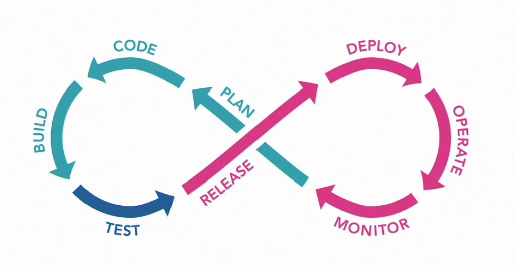
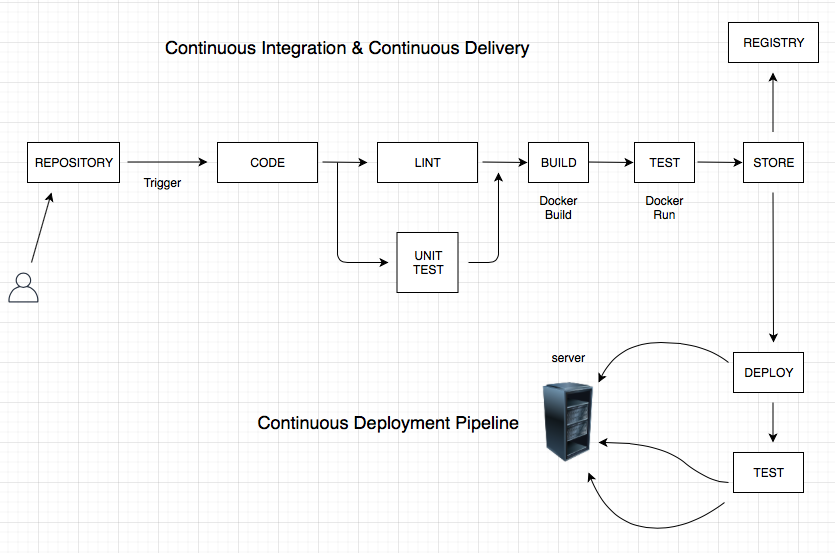
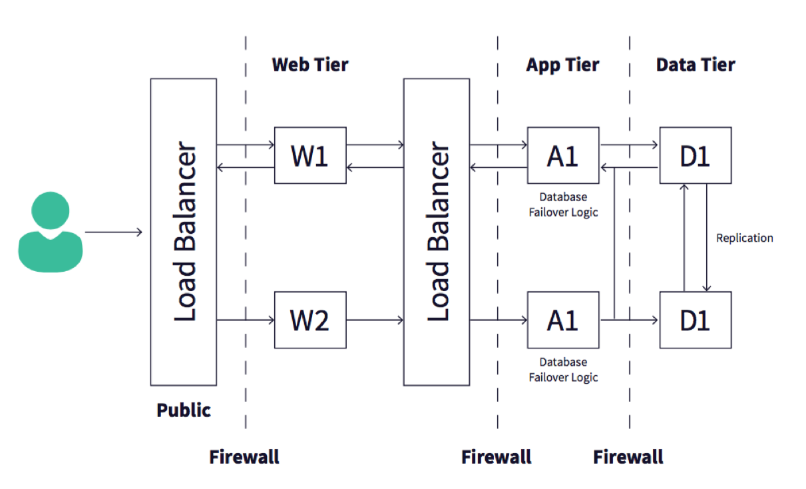

# Nail Your DevOps Interview

---
## 1. Interview Prep
- ##### Getting DevOps experience
  * ###### Start where you are, look for ways to apply DevOps principles
    - Deploy apps to a cloud platform
    - Use command line tools (ssh, etc.)
    - Practice on Free Tiers
      * [Amazon AWS](https://aws.amazon.com/free)
      * [Google Cloud](https://cloud.google.com/free)
      * [Microsoft Azure](https://azure.microsoft.com/free)

       

  * ###### Open-Sourse Projects
    - Make contributions to projects on GitHub.com
      * Update documentation, etc.

       

  * ###### Pro-Bono Work
    - Volunteer to you local non-profit orgs
    - Look around on [Taproot website](https://taprootfoundation.org)

       

  * ###### Document your solutions
    - Blog
    - Keep a diary

     

  * ###### Certifications
    - Significantly increases your chance at getting hired for a DevOps position
    - ***Cloud tools to focus on***
      * Application deployments
      * Configuration management
      * Container-based applications

- ##### Methods for answering questions
  * ###### Definition method
    - Recalling information to explain the appropriate information

       

  * ###### THX method
    - Time: number of years you've used a particular tool
    - How: how you've used or applied a tool or concept
    - Experience: support Time and How with a story of how you used a tool or concept

       

  * ###### Story time method
    - A narrative with a beginning, middle, and end
      * Beginning: the initial state, how things were before anything changed
      * Middle: decisions and actions you made
      * End: explain results or impact of your decisions and actions

       

  * ###### Show-and-tell method
    - Visually demonstrate the concepts that you've been explaining from the above methods

  

---
## 2. DevOps Business Practices Questions
- ##### Defining DevOps
  * ###### How do you define DevOps, and what does DevOps mean to you?
    - ### C-A-M-S
      * **C:** Culture
        - How teams interact
          * DevOps aims to have Development and Operations team interact in ways that breakdown the barriers between the teams
          * Have a clear focus on roles and responsibilities of each
        - Both teams share common goals

           

      * **A:** Automation
        - Used to speed up the feedback between teams
        - Use tools for collaboration between development and operations teams
        - **Key Tools:**
          * Revision control (pull requests)
          * Continuous integration
          * Configuration management

           

      * **M:** Measurement
        - Used for tracking ***improvement***
        - Find where the 'bottlenecks' are
        - Measuring the performance of production systems is also key
          * Ensure that deployments have not degraded anything. i.e. response time, etc.

      * **S:** Sharing
        - Allows for *cross-pollination* of ideas, problems, solutions between various teams throughout the entire organization
        - By transferring knowledge, the collective intelligence increases and benefits everyone

  

- ##### The DevOps Lifecycle

  

  * ###### Development Stages
    - ##### Plan
    - ##### Code
    - ##### Build
    - ##### Test

     

  * ###### Operational Stages
    - ##### Release
    - ##### Deploy
    - ##### Operate
    - ##### Monitor

  

- ##### Lean vs. Agile vs. DevOps
  * ###### Lean Software Development
    - Optimize development resources
    - Initial goal is delivering a minimum viable product
    - Once MVP is delivered
      * Take feedback from end-users
      * Make adjustments based on those feedback

       

  * ###### Agile Software Development
    - Scrum
      * Sprints
        - Develop application features in two-week sprints
        - Use inputs from end-users to add/remove features
        - Use inputs from end-users to fix bugs
      * New version created at end of sprint

       

  * ###### DevOps
    - Communication
      * Focus on collaboration
      * All teams are involved

       

    - Operations
      * All teams participate in operating the application

       

    - Flexibility
      * Seek to maintain capabilities to continuously monitor and respond to changes that might negatively impact the software in production

  

- ##### CI/CD
  * ###### How would you explain continuous integration and continuous delivery?
  * ###### What's your experience with automating deployments?
     

  * ###### Continuous Integration / Continuous Delivery / Continuous Deployment
    - #### Continuous Integration
      * **Code** in a local environment
      * **Commit changes** to a shared repository on a regular basis
      * **Integrate code** means combining code from other members of the team or any existing code
      * **Test code** for any errors
        - Helps developers find and resolve problems more quickly
         

    - #### Continuous Delivery
      * **Build Software**
      * **Test Software**
      * **Release Software**
      * ***NOTE:*** deployment is not included here
        - Keep producing artifact but doesn't include deployment
         

    - #### Continuous Deployment
      * Deployment completes without any human interaction: ***Build*** - ***Test*** - ***Deploy*** *into a production environment*
        - Automatically Build
        - Automatically Test
        - Automatically Deploy

         

      * **Four Categories of CI/CD Tools**
        - Self-hosted
          * Bamboo
          * TeamCity
          * ***Jenkins***
           

        - SaaS
          * TravisCI
          * Codeship
          * CircleCI
           

        - Cloud service providers
          * AWS
          * Google Cloud
          * Azure
           

        - Code repositories
          * GitHub
          * GitLab
          * Bitbucket

  

- ##### Configuration environment
  * ###### What configuration tools are you most familiar with, and have you used them?
    - #### Chef, Puppet
      * Master node: manages a collection of client nodes
      * Uses agents that runs on each client 
        - to communicate and enforce the client's configuration
      * Scheduled pull
        - Regular schedule
        - Pull updates to configurations each time
      * Uses Ruby DSL for configurations
      * More involved when setting up
         
    
    - #### Ansible
      * Runs from a ***control node***
      * On-demand push
        - push configuration to client only when initiated by the end user
      * Uses YAML format for configurations
      * Easy setup

  

- ##### Monitoring and alerting
  * ###### How do you know if something goes wrong in your production environment?
    - #### Through monitoring tools
    - #### The different types of monitoring
    - #### Alerting Tools
     

  * ###### Monitoring Tools
    - Nagios
    - Sensu
    - New Relic
    - Datadog
     

  * ###### Alerting Tools
    - PagerDuty
     

  * ###### Infrastructure Monitoring
    - CPU
    - Memory
    - Disk
     

  * ###### Synthetic Monitoring
    - Also known as ***active monitoring***
    - Monitor transactions against a website or web application
    - Scripts are used to send requests in exactly the same way a human user would
    - Response from the website is checked against known parameters
     

  * ###### Application performance monitoring (APM)
    - Provide overall status for web applications
    - Collect details at every level of the stack
    - Provide a complete picture of an application's performance
     

  * ###### Alerts
    - Notifications: bring something to your attention
    - Alarms: calls for immediate action and requires a response from you

  

- ##### Testing
  * ###### Functional Testing
    - Unit tests
    - Integration tests
    - Usually included in continuous integration pipeline
    - Tools:
      * Selenium
      * JUnit
      * Cucumber
       

  * ###### Performance Testing
    - Validate the way an application or system performs under certain conditions
      * Response tests: how quickly a system reponds
      * Load testing: how many requests a system can handle
      * Tools:
        - JMeter
        - Gatling
        - ApacheBench
         

- ##### Challenge: CI/CD
  * ###### The development team wants to move one of our applications from a server-based deployment to a container-based deployment.
  * ###### How would you diagram a CI/CD pipeline for creating the container image and deploying it to a production environment?
   

- ##### Solution: CI/CD
  
  

  

---
## 3. Common DevOps Skills
- ##### Operating systems
  * ###### Job Roles for Enterprise Applications
    - Focus on Windows-based operating systems
       
  
  * ###### Job Roles for Web or Mobile Applications
    - Focus on Linux operating systems
       

- ##### Command line tools
  * ###### THX Targets
    - How long you've been using command line tools
    - Give examples of the way you've used those tools
    - Share what your experience had been
       

  * ###### Definition Approach
    - Commonality
      * Being familiar with one operating system's command line, can immediately make you effective in another os's command line
       
    
    - Scale
      * How to make a change on thousands of systems through a web interface, very tedious.
      * Instead, use command line tools to effect change on all those same systems with just ***1 command***.
       

    - Speed
      * In many cases, it is easier to type commands in the command line than to poke around in a user interface
       
  
  * ###### What command line tools you should be familiar with
    - Commands that ***extract*** information from your system
      * CPU
      * Memory
      * Disk space utilization
      * Specifi commands to know:
        - `top` &rarr; system statistics
        - `free` &rarr; show memory utilization
        - `df`  &rarr; file system details
        - `ps` &rarr; what processes are running
         
  
  * ###### Text Processing
    - `grep`
    - `sed`
    - `awk`
     

  * ###### Additional Tools
    - `ping`
    - `curl`
    - `netcat`
     

  * ###### SSH Tools
    - Used to connect to remote systems
    - Transfer files between remote servers and your local file systems
    - Other tasks that require communication over a network
     

  * ###### Quick Access to Command Documentations
    - `info`
    - `man`

  

- ##### Scripting and programming
  * Bash / Powershell (or a shell language) - for CLI
  * Python - for APIs
  * Ruby - for working with configuration management tools
  * Go - for executables

  

- ##### Software version control
  * Git - know how to working from the command line
    - `git init`
    - `git clone`
    - `git add`
    - `git commit`
    - `git push`
    - `git pull`
       
  
  * Tracking changes
    - Pull requests - aka merge requests

  

- ##### Troubleshooting
  * ###### Ask questions
    - Services
    - Logs
    - Changes
    - Alerts
       

  * ###### Troubleshooting
    - Confirm the problem
    - Check components
    - Check logs

  

- ##### Incident management
  * ###### Incident Story
    
    | Beginning | Middle | End |
    |-|-|-|
    | When | Actual problem | Resolution |
    | What | Determine solutions ||
    | How |  ||
    | Scale |||

     

  * ###### Include details and describe your composure
    - Describe the process
    - Describe your communications

  

- ##### Security
  * ###### C: Confidentiality
    - Private information is secured
    - Secrets manager
    - Use version control systems with access limited according to roles
       

  * ###### I: Integrity
    - Data remains intact until an authorized change
    - HTTPS
       

  * ###### A: Availability
    - Continued access for users

  

---
## Cloud Services Questions

- ##### Cloud services and their benefits
  * 2 types of companies
    - Those that are running workloads in the cloud
    - Those that want to run workloads in the cloud
     

- ##### Define the benefits and how they complement the DevOps culture
  * Automation
    - Allows for fast iterations
    - Human errors are minimized

  * Scalability
    - Resources are available whenever you need them
    - Auto-scaling features
    - Services on demand
     

- ##### Architecting cloud solutions
  * Demonstrate your ability to translate business requirements into deliverable solutions
  * Solution architects take an idea and turn it into an operationally correct blueprint
  * Show ability to communicate technical concepts
  * Certifications
    - AWS Certified Solutions Architect
    - Microsoft Azure Solutions Architect
    - Google Cloud Professional Cloud Architect
   

- ##### Infrastructure as code
  * Engineers use code to describe servers, load balancers, firewalls, and other resources that create a system to run an application
  * Use version control
  * Consistency
  * Modularity and Reuse
  * Infrastructure
    - AWS - CloudFormation
    - Google Cloud - Deployment Manager templates
    - Azure - Resource Manager templates

  

---
## 5. Applications and Services Questions
- ##### Apache vs. NGINX, what's the difference?
  * ###### Apache Example
    - Natively serving dynamic content
      * Serves PHP or Python without having to interface with another application
      * May use increased resource usage under heavy load
         

  * ###### NGINX Example
    - Efficient service for static content
    - No dynamic content
    - High-performance reverse proxy
       

  * ###### So, what is the difference between the two?
    - An efficient implementation can use NGINX as a ***proxy*** for Apache
    - In this case, NGINX handles the static content, and then passes the dynamic requests to Apache.
    - In this configuration, static content is served quickly and efficiently by NGINX. Apache's resources and thus kept at manageable levels.
    - NGINX config files are written in a format that looks like code
    - Apache's config files are XML-based
       

- ##### Databases
  * ###### Relational Databases and NoSQL Databases
  * ###### What's the difference between a relational db and a NoSQL db?
    - Relational db
      * The model is similar to a spreadsheet
      * Data is stored in tables using rows and columns
      * Before a relational db can be used, the tables and columns need to be defined so the db application knows what kind of data will be stored in each row
         

    - NoSQL db
      * A schema isn't required to get started
      * The data model can change with each item stored in the db
         
    
    - Examples
      * MySQL
      * Postgres
      * MongoDB
         

  * ###### What's the benefit of using a NoSQL db instead of a relational db?
    - Large volumes of structured, semi-structured, and unstructured data
    - Agile sprints, quick iteration, and frequent code pushes
    - Object-oriented programming that is easy to use and flexible
    - Efficient, scale-out architecture instead of expensive, monolithic architecture
    - [REFERENCE: MongoDB website](https://www.mongodb.com/scale/advantages-of-nosql)

  

- ##### Containers
  * ###### What is a Docker file?
    - Text document with commands to assemble an image
    - Storage location for specific steps
    - Trackable and shareable files
    - Industry standard for defining container images
    - ***Dockerfile***
      * Defines the process and environment
     

  * ###### What is a container image?
    - Created from the dockerfile
    - Contains runtimes, libraries, configurations
    - Stored in an image registry
    - Most popular public registry is Docker Hub
    - ***Image***
      * Can be stored in a registry, and retrieved when needed
      * Can be used in different environments like development, testing, and production
     

  * ###### What is a container?
    - Created by container images
    - Identified as the **actual system process**

  

- ##### Challenge: Diagramming web architecture
  * Diagram an N-tier web architecture
      

- ##### Solution: Diagramming web architecture
  
  
