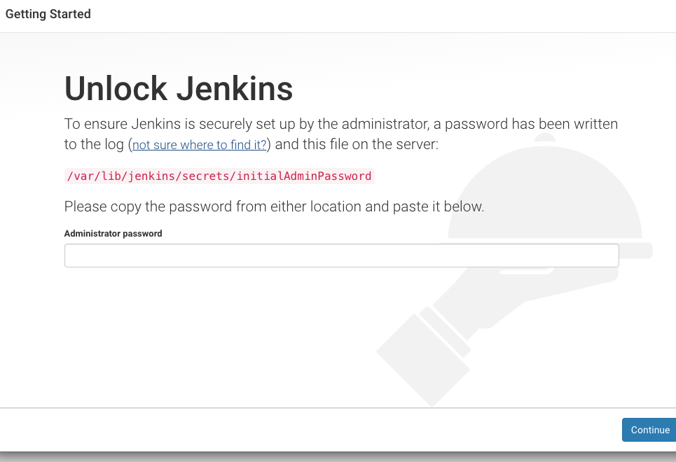

#### :house: [REVATURE workspace, HOME (`github`)](https://github.com/joedonline/REVATURE__workspace)  :house:
---
# :calendar: [WEEK 06](https://github.com/joedonline/REVATURE__workspace/tree/master/WEEK__06)
## Thursday, Jan. 23rd 2020

---
## Git: Pull Requests
- #### Open a pull request
  * `base: master` &larr; `compare: week6`
  * Review changes
  * Click 'Open pull request'
  * Write notes
  * Click 'Close pull request'
  * Click 'Delete branch'

### Dependabot
- [REFERENCE: Dependabot website](https://dependabot.com/)
- [REFERENCE: GitHub repo](https://github.com/dependabot)

<br>

---
## Pipeline
- Series of steps, usually automated
- Builds/tests/deploys your project
- [Pipeline Examples (Jenkins)](https://jenkins.io/doc/pipeline/examples/)

  

<br>

**203** - ???

---
## CI - Continuous Integration
- Integrate code within the team at least daily
- Have a **pipeline** that automatically builds and tests integrated code

<br>

---
## CD - Continuous Delivery
- Taking pushes to GitHub all the way through to *build artifacts* ready for deployment

<br>

---
## CD - Continuous Deployment
- Pushes to GitHub are deployed to production via a pipeline

<br><br>

---
## DevOps
- The combination of <u>Development</u> (writing code) and <u>Operations</u> (deploying code).
- It's a **"culture change"** or **"mindset"** applied by companies/teams.
- Often, it looks like:
  * Teams are responsible for both writing and deploying their applications
  * Also often involves using Dev tools in Ops
    - e.g. keeping track of deployment steps on GitHub

---
## Jenkins
- Builds Server, used to automate CI/CD pipelines and processes
- Can deploy Jenkins build agents, where Jenkins itself(Master) parcels out build tasks to other machines (Agents)
- Runs on Tomcat (embedded or `.war`)

---
## More Shell Scripting

- `ssh i /c/mykeys/?.pen ec2-user@endpoint`
- `nano filename.sh`

---
**Glossary**
- `!#` - shabang

---

  ```
  #!/bin/bash

  sudo yum install java-1.8.0-openjdk-level -y
  sudo yum install maven -y
  sudo yum install git -y
  sudo amazon-linux-extras install tomcat8.5 -y
  ```

- `bash setup.sh`
- `cat setup.sh | grep maven`

<br>

### Install Jenkins
- `touch installJenkins.sh`

```
#!/bin/bash

sudo yum install java-1.8.0-openjdk-level -y
sudo yum install maven -y
sudo yum install git -y
sudo amazon-linux-extras install tomcat8.5 -y
```

- `sh installJenkins.sh`
- `sudo service jenkins start`



- `sudo visudo` - ???

---
## GitHub
- `git clone <url>`

---
## Jenkins: Env Vars

```
# deploy.sh

#!/bin/sh

cd comicappv2
mvn package
sudo rm -f /var/lib/tomcat/webapps/comicappv2.war
sudo cp target/comicappv2.war /var/lib/tomcat/webapps/
sudo service tomcat restart

# env vars -> tbd
```

<br>

---
## Object Relational Mapping (ORM)
- [REFERENCE - Hibernate website](http://hibernate.org/orm/)
- An ORM maps relations (tables) in SQL to Object in Java
- Hibernate (the ORM tool we use) will be responsible for mapping columns to fields.
  * This means we won't need to write SQL
- Instead of JDBC interfaces like `PreparedStatement` and `ResultSet`, we'll use Hibernate interfaces: **Criteria and Query**
- Instead of updating our database with SQL, we just update the Objects.

---
#### QUICK REVIEW

### ACID Properties (Transactions)
- **A**tomic - succeed or fail as one unit
- **C**onsistent - takes database from one valid state to another
- **I**solated - transactions don't interfere with one another
- **D**urable - transactions persist through catastrophe
---

<br>

### Object States in Hibernate
- **transient:** This object is not tracked by Hibernate, so it's not saved in the database
  * [transient: vocabulary.com](https://www.vocabulary.com/dictionary/transient)
- **persistent:** This object *is* tracked by Hibernate, and *is* saved in the database
- **detached:** This object *was* tracked by Hibernate, but our Hibernate session was closed

### Sample Code in your Java (Hibernate)

```
Person p:
...
...
...
p.setName("Name");

@Table("persons")
public class Person {

  @Id
  private Integer id;

  @Column("name")
  private String name;

}

}
```
