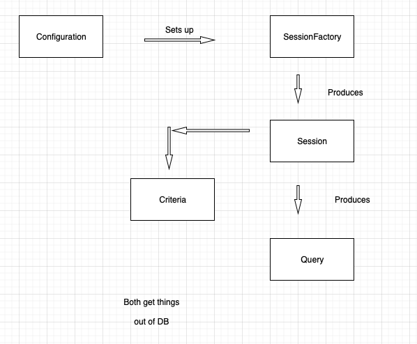

#### :house: [REVATURE workspace, HOME (`github`)](https://github.com/joedonline/REVATURE__workspace)  :house:
#### :house_with_garden: [REVATURE workspace, HOME (`delta`)](https://github.com/deltachannel/REVATURE__workspace) :house_with_garden:
---
# :calendar: [WEEK 06](https://github.com/joedonline/REVATURE__workspace/tree/master/WEEK__06)
## Friday, Jan. 24th 2020

---
## Hibernate: Query 
- Looks/works like a SQL query (`PreparedStatement`), except it uses HQL (Hibernate Query Language)

## Hibernate: Criteria
- Object-Oriented way of retrieving objects from DB

 

### Interfaces of Hibernate

 

---
## Why Hibernate? Why ORM?
- Gavin King
- Switch out HP for another ORM using JPA annotations

### Benefits
- ORM tools work with **all** SQL Dialects
- `HQL`, `Criteria`, or `Session CRUD`

### Caching
- HB has Level 1 (L1) caching built into its Sessions. This prevents repeat trips to the DB

### Lots of devs don't know SQL
- work through Java

 

---
## Why AWS?
- They provide/manage services and infrastructure that would be expensive or impractical to manage yourself
- Elasticity, auto-scaling, resource provisioning
- Security managed by experts

---
## Why DevOps?
- Easier communication w/ Dev & Ops
- Ensure code is portable

---
## Why CI/CD?
- Better product via rapid feedback & agile methodology
- Makes working on a team easier, etc.
  * Feedback from test and build
  * Improved flow, devs know how to move forward with comleted code
  * Continuously Integrated:
    - Code can't diverge between devs
    - Ensures good testing
    - Standardized process so new devs can jump in immediately

---
## Unix
- An OS create in the late 60s / early 70s
- We don't use Unix, we use Unix-like tools
- In the early 80s, AT&T/Bell, who owned Unix started selling closed-source/non-extensible Unix
- Hobbyists moved to GNU project
- Academics moved to BSD
- The GNU (GNUs not Unix) developed as open source, copy-left software
- Linux was a kernel that worked with GNU to create a full OS: GNU/Linux

---
### Open Source
- Open for Extension/Modification (free as in freedom, not free as in beer).

### Copy Left
- Open-source software that cannot be used to make closed-source derivatives

---
### Linux
- Linus Torvalds

---
### GNU
- Richard Stallman

 

---
### File Permissions
- **What can I do?** 
  * `rwx`: read, write, execute
  * we can have any combo of the 3

   

- **Who is allowed to do things?**
  * Owner gets their own `rwx` permissions
  * Members of a group get one set of `rwx` permissions
  * Anyone else gets one set of `rws` permissions

 

### Specify file permissions
- `rwxr-xr--`
  * Owner can do anything
  * Group can read & execute
  * Public can only read
  * `ls -l` 
  * examples:
    - `chmod ### file`
    - `chmod 777 myOpenFile.txt` -- open
    - `chmod 740 myRWXR-----File.txt` -- open
    - `chmod 660 myRV-RV----File.txt` -- read/write
    - `chmod +x filename`
- Permissions:
  * `4` -- read
  * `3` -- write
  * `1` -- execute
  * write & execute permissions -- 2 + 1 = 3
  * read & write permissions -- 4 + 2 = 6
