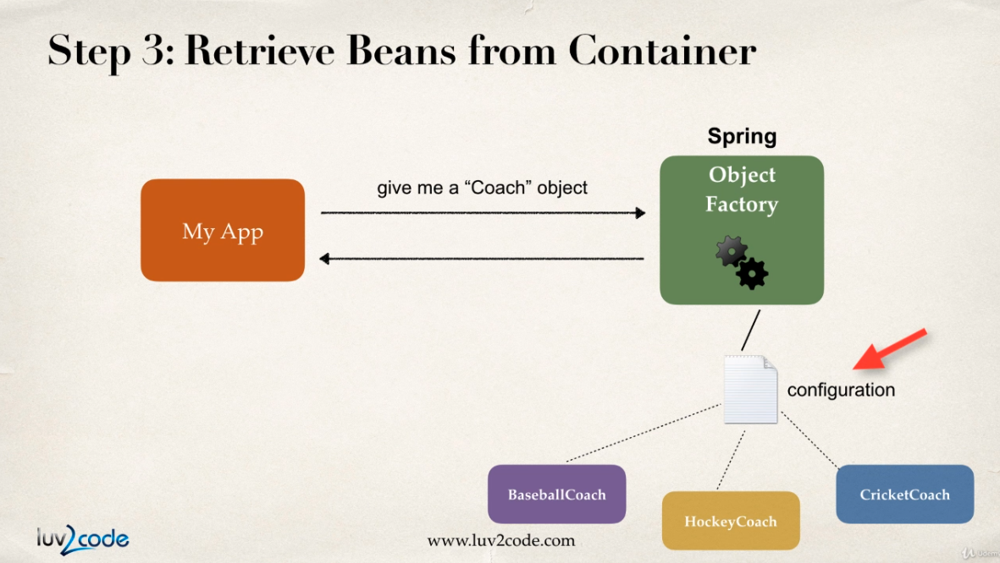
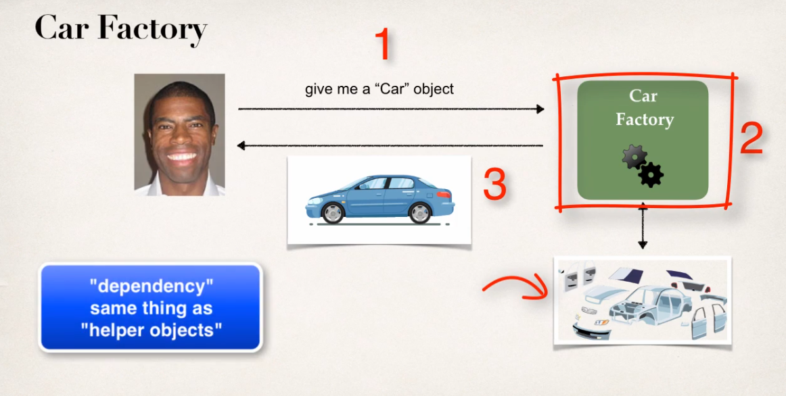

#### :house: [REVATURE workspace, HOME (`github`)](https://github.com/joedonline/REVATURE__workspace)  :house:
#### :house_with_garden: [REVATURE workspace, HOME (`delta`)](https://github.com/deltachannel/REVATURE__workspace) :house_with_garden:
---
# :calendar: [WEEK 07](https://github.com/joedonline/REVATURE__workspace/tree/master/WEEK__07)

---
# Spring & Hibernate for Beginners

<br>

---
### REFERENCES
- [PDF files, reading refs](https://drive.google.com/drive/folders/1zDfab3auDuLhFwmnQpZy5RIATU43qopZ)
- [Spring Framework Releases, .jar files](https://repo.spring.io/release/org/springframework/spring/)

<br>

---
### Inversion of Control (IoC)
- The approach of outsourcing the construction and management of objects
- Outsource to an object factory
- [A programming principle in software engineering...](https://www.google.com/url?sa=t&rct=j&q=&esrc=s&source=web&cd=12&cad=rja&uact=8&ved=2ahUKEwi5jbWtnavnAhXKmXIEHX2aDb0QFjALegQIAxAB&url=https%3A%2F%2Fen.wikipedia.org%2Fwiki%2FInversion_of_control&usg=AOvVaw2tuRUAl26TmEMEZq4GcDKP)

<br>


<br>

### Spring Container
- #### Primary functions
  * Create and mange objects (Inversion of Control)
  * Inject object's dependencies (Dependency Injection)

- #### Configuring Spring Container
  * XML configuration file (legacy, but most legacy apps still use this)
  * Java Annotations (modern)
  * Java Source Code (modern)

<br>

### Spring Development Process
1. Configuring your Spring Beans
2. Create a Spring Container
3. Retrieve Beans from Spring Container

<br>


<br>


<br>


<br>



<br>


<br>

##### `HelloSpringApp.java`

```
public class HelloSpringApp {

  public static void main(String[] args) {

    //load the spring configuration file
    ClassPathXmlApplicationContext context = new ClassPathXmlApplicationContext("applicationContext.xml");
    
    //retrieve bean from spring container
    Coach theCoach = context.getBean("myCoach", Coach.class);
    
    //call methods on the bean
    System.out.println(theCoach.getDailyWorkout());
    
    //close the context
    context.close();

  }

}
```

<br>

##### `applicationContext.xml`

```
<?xml version="1.0" encoding="UTF-8"?>
<beans xmlns="http://www.springframework.org/schema/beans"
    xmlns:xsi="http://www.w3.org/2001/XMLSchema-instance" 
    xmlns:context="http://www.springframework.org/schema/context"
    xsi:schemaLocation="http://www.springframework.org/schema/beans
    http://www.springframework.org/schema/beans/spring-beans.xsd
    http://www.springframework.org/schema/context
    http://www.springframework.org/schema/context/spring-context.xsd">

    <!-- Define your beans here -->
    <bean id="myCoach" class="com.luv2code.springdemo.TrackCoach"></bean>
</beans>
```

<br><br>

---
## Dependency Injection

- ### The Dependency Inversion principle
  * The client delegates calls to another object the responsibility of providing its dependencies.

<br>



<br>


<br>

- ### Injection Types
  * There are many types of injection with Spring
  * The two most common are:
    - **Constructor Injection**
    - **Setter Injection**

<br>

- ### Development Process: Constructor Injection
  1. Define the dependency interface and class
  2. Create a constructor in your class for injections
  3. Configure the dependency injection in Spring config file

<br>


<br>


<br>


<br>


<br>
