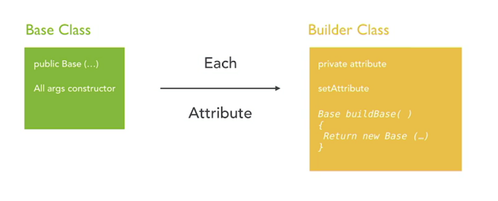
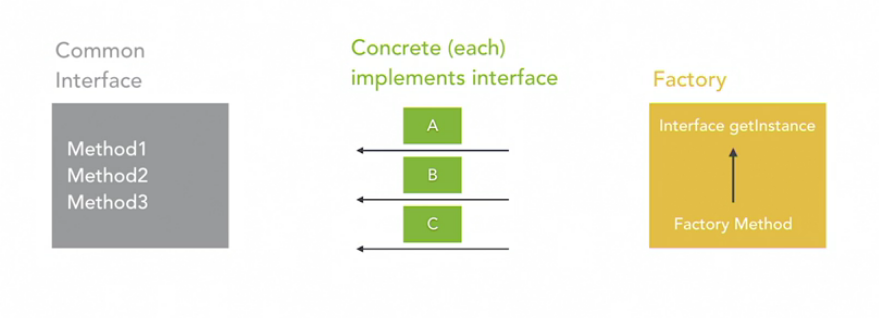

# Spring: Design Patterns

<br>

---
## 1. Design Patterns and Spring

<br>

#### The patterns of the Spring Framework
- ###### Inversion of Control (IoC) Pattern
  * This is the big one
  * The entire runtime of the framework is based on IoC
  * Improves testability, decreases coupling, enforces coding to an interface
  <br>

- ###### Proxy Pattern
  * Since 4.0, involved in every object managed by Spring
  * Brings some major caveats to the operation of Spring
  * Allows addition of behaviors that we leverage throughout the framework
  <br>

- ###### Factory Pattern
  * IoC container is a factory
  * Heavily leveraged in startup and runtime operation of Spring
  * First class support for factories in your code
  <br>

- ###### Singleton and Prototype Patterns
  * Most of your objects configured for Spring leverage these two patterns 
  * Singleton is most popular
  * Not a traditional singleton implementation, but works the same
  <br>

- ###### Template Pattern
  * Used widely in remote calls
  * JDBC and REST are the most popular situations
  * Also implemented by third parties to remove boilerplate code for using their tooling
  <br>

- ###### Model-View-Controller Pattern
  * Entire web framework is based on this
  * Traditional web pages as well as RESTful services
  * Not a classic pattern, but very important in Spring

<br><br>

#### Inversion of Control: The core pattern
- ###### What is IoC?
  * Not a Gang of Four design pattern
  * Architectural pattern for relegating control of dependencies to the container instead of the developer
  * Often called Dependency Injection, though that is one flavor of IoC
  <br>

- ###### How does it work?
  * Central container constructs and maintains all object references
  * Hands them to other objects when needed at runtime (or startup)
  * Centralized control and management
  <br>

- ###### IoC in Spring
  * Spring manages your dependencies
  * Objects injected at runtime, not compile time
  * An object accepts the dependencies for construction instead of you constructing them
  <br>

- ###### Benefits of IoC
  * Reduces noise in your code
  * Reduces object coupling
  * Reduces the defects that arise from incorrect construction
  <br>

- ###### `ApplicationContext`
  * Spring: `ApplicationContext` is the IoC container
  * Another pattern in play that we will talk about later with `BeanFactory`
  * Leverages the configuration to create the beans and manage the dependency injections

<br><br>

---
## 2. Creational Patterns in Spring

<br>

#### The Factory pattern
- ###### Use in Spring
  * BeanFactory
  * FactoryBean
  * Leveraged heavily in the framework
  <br>

- ###### Pattern in a Nutshell
  * Factory allows construction of similar classes of different types using a factory method
  * Method call creates the object for you and serves it back 
  * Constructed objects are from classe sthat share an interface or parent class
  <br>

- ###### Why Use This Pattern?
  * Allows you to not worry about class construction in more than one place
  * Allows you to leverage the interface for repetitive operations
  * Lack of construction code cleans up code and also makes copy/paste errors less likely
  <br>

- ##### Creation Strategy
  * Programming Principle: Coding to an interface instead of an concrete implementation
  <br>

  

  <br>

- ###### Abstract Factory Pattern
  * Takes the pattern one step further
  * Factory of factories
  * Adds a new level of abstraction that becomes powerful if you have a bunch of types that also have a bunch of types

<br><br>

#### Factory pattern in action

  ```
  // PetFactory.java
  @Component
  public class PetFactory {

    public Pet createPet(String animalType) {
      switch(animalType.toLowerCase()) {
      case "dog": 
        return new Dog(); 
      case "cat":
        return new Cat();
      default: 
        throw new UnsupportedOperationException("Unknown animal type");
      }
    }
    
  }
  ```

  <br>

  ```
  // AppController.java
  @RestController
  @RequestMapping("/")
  public class AppController {

    @Autowired
    private PetFactory petFactory;

    @GetMapping
    public String getDefault() {
      return "{\"message\": \"Hello World\"}";
    }

    @PostMapping("adoptPet/{type}/{name}")
    public Pet adoptPet(@PathVariable String type, @PathVariable String name) {
      Pet pet = this.petFactory.createPet(type);
      pet.setName(name);
      pet.feed();
      return pet;
    }

  }
  ```

#### The Builder pattern
- ###### Use in Spring
  * Used in various places in the framework
  * `ResultActions` is one often used (MockMvc)
  * Lombok `@Builder` annotation: not genuinely Spring, but widely accepted
  <br>

- ###### Pattern in a Nutshell
  * Each method returns the object reference it's called from
  * Build method returns a fully constructed object
  * Functionality can be combined into one class
  <br>

- ###### Why Use This Pattern?
  * Useful when object creation has many parameters
  * Becomes increasingly more useful when some or all parameters are optional
  * Can make code easier to read because of reduced lines for construction when compared with setters
  <br>

  

<br><br>

#### Builder pattern in action

  ```
  // Contact.java
  public class Contact {

    private String firstName;
    private String lastName;
    private String emailAddress;

    public Contact() {
      super();
    }

    public Contact(String firstName, String lastName, String emailAddress) {
      super();
      this.firstName = firstName;
      this.lastName = lastName;
      this.emailAddress = emailAddress;
    }

    public String getFirstName() {
      return firstName;
    }

    public void setFirstName(String firstName) {
      this.firstName = firstName;
    }

    public String getLastName() {
      return lastName;
    }

    public void setLastName(String lastName) {
      this.lastName = lastName;
    }

    public String getEmailAddress() {
      return emailAddress;
    }

    public void setEmailAddress(String emailAddress) {
      this.emailAddress = emailAddress;
    }

  }
  ```

  <br>

  ```
  // ContactBuilder.java
  public class ContactBuilder {

    private String firstName;
    private String lastName;
    private String emailAddress;

    public ContactBuilder setFirstName(String firstName) {
      this.firstName = firstName;
      return this;
    }

    public ContactBuilder setLastName(String lastName) {
      this.lastName = lastName;
      return this;
    }

    public ContactBuilder setEmailAddress(String emailAddress) {
      this.emailAddress = emailAddress;
      return this;
    }

    public Contact buildContact() {
      return new Contact(firstName, lastName, emailAddress);
    }
    
  }
  ```

  <br>

  ```
  // AppController.java
  @RestController
  @RequestMapping("/")
  public class AppController {

      @Autowired
      private PetFactory petFactory;

      @GetMapping
      public String getDefault(){
          return "{\"message\": \"Hello World\"}";
      }

      @PostMapping("adoptPet/{type}/{name}")
      public Pet adoptPet(@PathVariable String type, @PathVariable String name){
          Pet pet = this.petFactory.createPet(type);
          pet.setName(name);
          pet.feed();
          return pet;
      }

      @GetMapping("presidents")
      public ArrayList<Contact> getPresidents() {
        ArrayList<Contact> contacts = new ArrayList<Contact>();
        
        Contact contact = new Contact();
        contact.setFirstName("George");
        contact.setLastName("Washington");
        contacts.add(contact);
        
        contacts.add(new Contact("John", "Adams", null));
        
        contacts.add(new ContactBuilder().setFirstName("Thomas").setLastName("Jefferson").buildContact());
        return contacts;
      }
      
  }
  ```

<br><br>

#### The Singleton pattern
- ###### Use in Spring
  * Every bean by default is a singleton
  * Not a classic singleton, but behaves the same
  * Beans must be thread safe
  <br>

- ###### Pattern in a Nutshell
  * Class stores reference to instance of itself
  * Constructor is private
  * Static `getInstance()` method returns reference of self instance, or if not constructed it constructs in thread safe manner
  * The `new` command is never called on the class outside of the `getInstance()` method
  <br>

- ###### Why Use This Pattern?
  * Expensive object creation
  * Control concurrency associated shared resources
  * Storing static state for multiple parts of the application

<br><br>

#### Singleton pattern in action
- 
