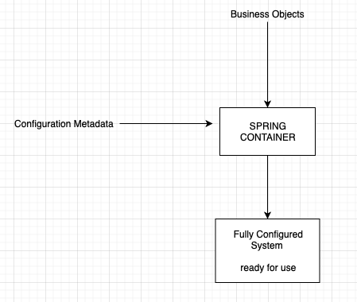

#### :house: [REVATURE workspace, HOME (`github`)](https://github.com/joedonline/REVATURE__workspace)  :house:
#### :house_with_garden: [REVATURE workspace, HOME (`delta`)](https://github.com/deltachannel/REVATURE__workspace) :house_with_garden:
---
# :calendar: [WEEK 07](https://github.com/joedonline/REVATURE__workspace/tree/master/WEEK__07)
## Tuesday, Jan. 28th 2020

---
## Spring Framework

- ###### [REFERENCE: Slides](Intro_Spring_Framework.pdf)

 

- A framework written in and for Java
- In some ways similar to Angular for TypeScript
- A lightweight solution and one-stop-shop for building <u>enterprise applications</u>
- It is **modular**
  * We can include any of about *20 different modules* in our apps
- It is built around an [**IoC** - Inversion of Control](https://www.journaldev.com/2461/spring-ioc-bean-example-tutorial)
  * This container makes use of Dependency Injection for all Spring-managed objects.

 

---
##### Definition Keywords
- **Framework**
- **<u>one-stop-shop</u> for building enterprise applications**
- **modular**
- **IoC: Inversion of Control**
  * is responsible for 
    - *instantiating*
    - *configuring*
    - *assembling beans*
- **built around an IoC Container**
- **Dependency Injection**
---
 

### IoC: Inversion of Control
- a more abstract term for Dependency Injection

 

### Bean
- any object managed by Spring
- can just be POJOs
- these objects in Spring, can be called <u>**Spring Beans**</u>

 

### Spring "core"
- It consists of 3 modules
-  **spring-core**
-  **spring-beans**
-  **spring-context**
- Consist of the IoC container and Spring Beans
- We will see these in the POM

 

### IoC Container
- The goal of the IoC Container is to ***decouple*** execution from configuration, making a more modular codebase
- It is responsible for:
  * instantiating
  * configuring
  * assembling beans
- It accomplishes this using **Configuration** metadata

 

### Configuration
- Happens via 3 different methods:
  * "Classic" XML Configuration   
  * Java Configuration with:
    - `@Configuration`
    - `@Bean`  
  * #### Annotation-based configuration with:
    - `@Component`
    - `@Repository` 
      * [REFERENCE: JournalDev](https://www.journaldev.com/21460/spring-repository-annotation)
    - etc.   
- **Configuration** specifies Beans and their dependency relationships
- Many modules and projects include their own preconfigured beans

  

---
## Application Context
- The `ApplicationContext` is the IoC Container in Spring
- `ApplicationContext` is an `Interface` in Java
- It is also a *sub-interface* of `BeanFactory`

 

## ApplicationContext vs. BeanFactory

| `ApplicationContext` | `BeanFactory` |
|-|-|
| newer | older |
| *eagerly* instantiates the beans | *lazily* instantiates beans |
| beans *can* be singletons, but have other scopes | beans are **singletons** (singleton scope) |

 

### What ApplicationContext Does
- Provides Dependency Injection ( *Bean Wiring* )
- Manage the *Spring Bean Lifecycle*
- Manage Bean scopes

 

### Bean Wiring
- This is when you are actually connecting Beans and their configured dependencies   
- The easiest method is *autowiring*
  * using **`@Autowired`** annotation   
- We can wire beans by:
  * their name (custom string); or
  * by type (Java class)   

 

### Bean Scope
- How many instances of a Bean exists
- and **when** they are instantiated

 

### Two Scopes for ApplicationContext
- **Singleton:** only one exist
- **Prototype:** a new bean every time it is used

  

## The Bean Lifecycle, Generally

Instantiate the Bean **&rarr;** set properties **&rarr;** configure dependencies **&rarr;** instantiate dependencies & default values &rarr; custom init methods **&rarr;** then Bean can be used.

**&darr;**

Bean in use

**&darr;**

Custom destroy method **&rarr;** dereferrence Bean when it passes out of scope

 

### THE BEAN LIFECYCLE

| Stage | Context |
|-|-|
| Instantiate Bean | Java Object setup |
| Populate properties | Java Object setup |
| `BeanNameAware.setBeanName()` | ApplicationContext |
| `BeanFactoryAware.setBeanFactory()` | ApplicationContext |
| `ApplicationContextAware.setApplicationContext()` | ApplicationContext |
| `BeanPostProcessor` pre-initialization | ApplicationContext |
| `InitializingBean.afterPropertiesSet()`   <small>(we can specify custom functionality here)</small> | ApplicationContext |
| Custom init method or methods   <small>(we can specify custom functionality here)</small> | ApplicationContext |
| `BeanPostProcessor` Post initialization | ApplicationContext |
| Bean is ready for use! |  |
| `DisposableBean.destroy()`   <small>(we can specify custom functionality here)</small> |  |
| Custom destroy method or methods   <small>(we can specify custom functionality here)</small> |  |

 

- **In general, we don't interfere with lifecycle**
- **We can specify custom functionality:**
  * Implement InitializingBean / DisposableBean
  * Specify methods in XML
