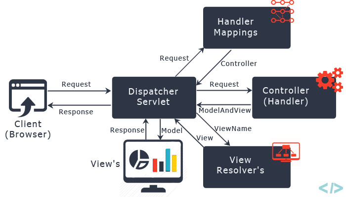

#### :house: [REVATURE workspace, HOME (`github`)](https://github.com/joedonline/REVATURE__workspace)  :house:
#### :house_with_garden: [REVATURE workspace, HOME (`delta`)](https://github.com/deltachannel/REVATURE__workspace) :house_with_garden:
---
# :calendar: [WEEK 07](https://github.com/joedonline/REVATURE__workspace/tree/master/WEEK__07)
## Wednesday, Jan. 29th 2020

<br>

---
## Spring Stereotype Annotations
- #### `@Repository`, `@Service`, `@Controller`
  * Each of them inherits from `@Component` so they mark Classes as Beans
  * These mostly exist to document the purpose of the Bean
  * `@Repository` and `@Controller` do offer additional functionality
  * `@Repository` is used to map specific data access Exceptions to generic Spring exceptions for easier Exception handling

<br>

- #### Enabled with Component Scanning:

  ```
  <context:component-scan></context:component-scan>

  or

  <mvc:annotation-driven></mvc:annotation-driven>
  ```

<br>

- *NOTE 1:* **Spring Framework: 20 modules, modular**
- *NOTE 2:* **Spring Projects: Projects built on top of Spring framework, also modular**
- *NOTE 3:* **Spring ORM: module in Spring Framework, integrates Spring w/ Hibernate**

<br><br>

---
## Spring ORM

#### Integrate Hibernate with Spring features
- Dependency Injection
- Aspect-Oriented Programming (tbd)

<br>

#### Allows Spring
- to manage our transactions instead of manual management
- Configure Data Access using Spring Beans instead of `hibernate.cfg.xml`

<br>

#### Spring ORM Beans
- **DataSource**
  * Contains driver info, username, database URL, etc.
  * Injected into `SessionFactory` Bean
- **SessionFactory**
  * Contains Hibernate-specific `config: show_sql, dialect, etc.`
  * Acts as the familiar `SessionFactory`
- **TransactionManager**
  * Manages transactions when we use the `@Transactional` annotation

<br><br>

---
## Spring WebMVC
- Build a Server in Spring
- Uses Servlets under the hood
- Follows FrontController and MVC Design pattern

#### 2 Modules:
- Spring-WebMVC
- Spring-Web

<br>

#### Quick Review: FrontController Design Pattern
- Has a single Servlet receiving all requests and passing them out to other Controllers

<br>

#### Quick Review: MVC
- Model
  * Our *data* being passed, rendered, manipulated <br><br>
- View
  * What the user sees, typically HTML <br><br>
- Controller
  * Handles logic
  * Handles routing <br><br>

  **MVC**

  

  <br><br>

  **Spring MVC**

  

<br><br>

---
## Overview
- Centered around a `DispatcherServlet` that implements FrontControl Design Pattern
  * This DispatcherServlet subclasses HTTPServlet and uses web.xml
- DispatcherServlet has its own WebApplicationContext
- Highly flexible data binding and view resolution; modular

<br><br>

---
## WebApplicationContext
- ApplicationContext but for the web!
- Tied to our DispatcherServlet view Servlet Context
- Has more scopes than ApplicationContext
  * request
  * session
  * global
- Contains WebMVC beans

<br>

#### WebApplicationContext Default Beans
- **HandlerMapping:** 
  * maps incoming requests to appropriate controllers
  * the DispatcherServlet uses this bean to route requests
  * configured using annotations in @Controller beans

<br>

- **ViewResolver:**
  * maps logical String view names to actual views, ..., to other default beans as well

<br>

- In addition to default beans, the WebApplicationContext can hold beans we create

<br>

- For any beans not found in a WebApplicationContext, Spring will automatically check the root ApplicationContext
